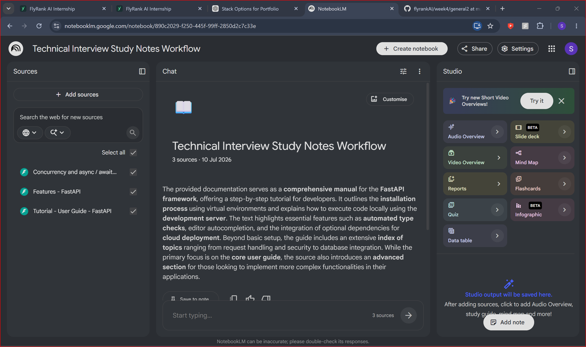
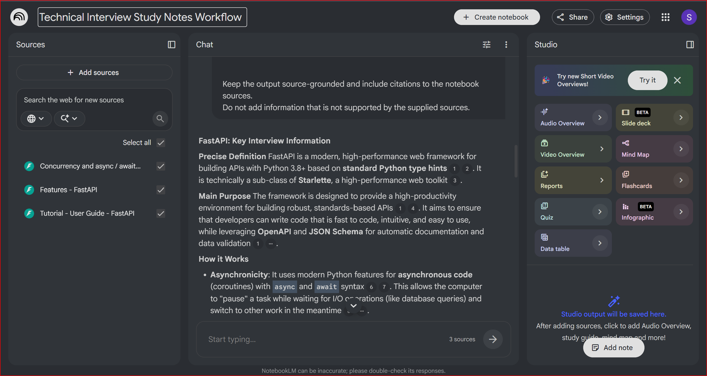
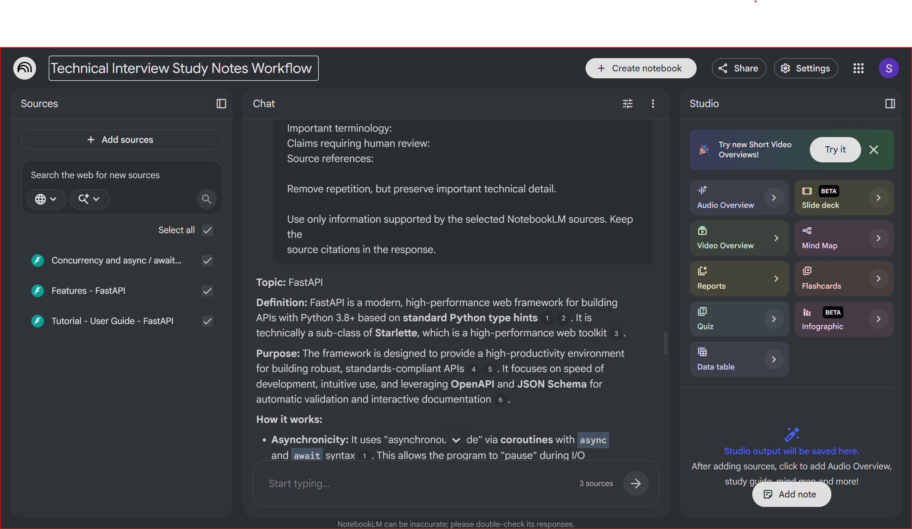
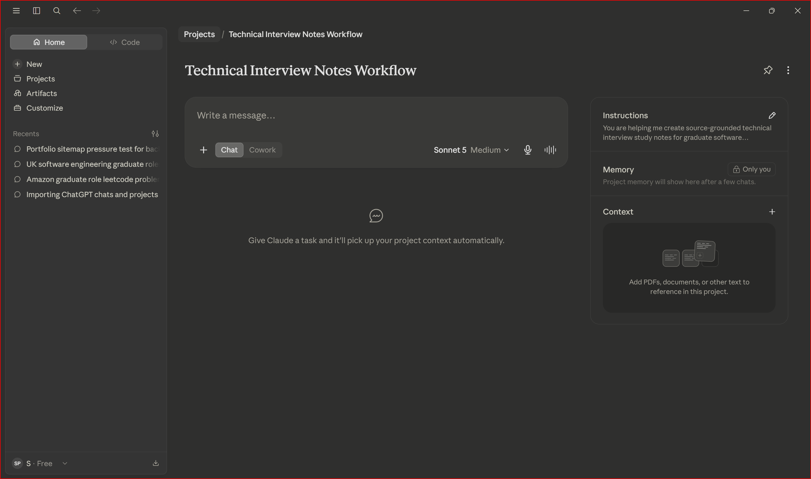
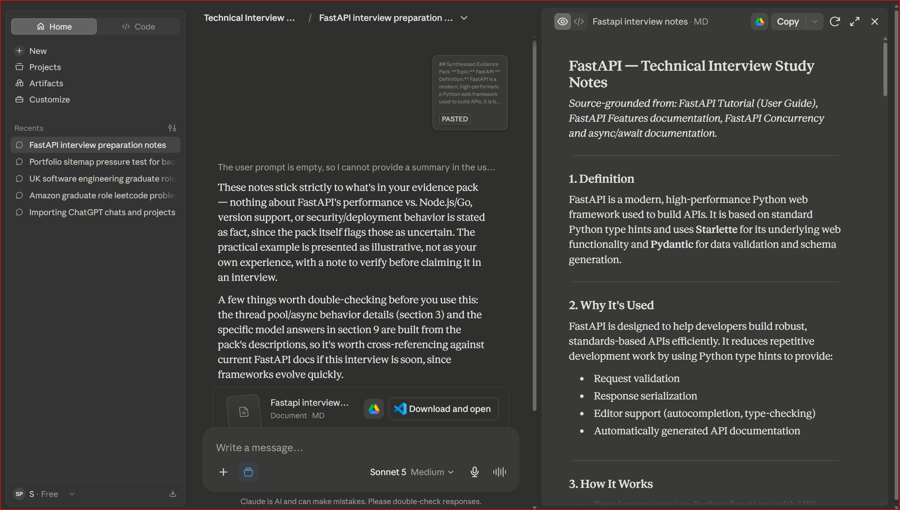
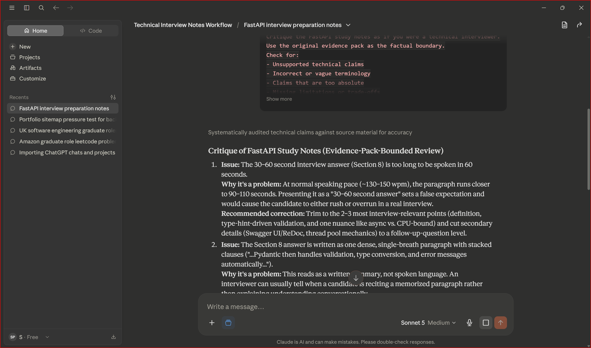
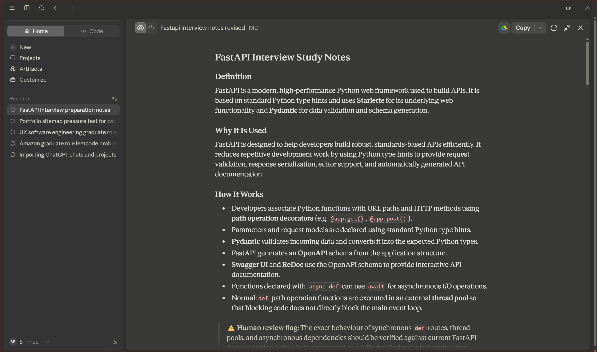

# Run 1: FastAPI

## Input

FastAPI

## Sources

- FastAPI Tutorial – User Guide
- FastAPI Features documentation
- FastAPI Concurrency and async/await documentation

## Gather Output

### FastAPI: Key Interview Information

**Precise Definition**

FastAPI is a modern, high-performance web framework for building APIs with Python 3.8+ based on **standard Python type hints**. It is technically a subclass of **Starlette**, a high-performance web toolkit.

**Main Purpose**

The framework is designed to provide a high-productivity environment for building robust, standards-based APIs. It aims to ensure that developers can write code that is fast to code, intuitive and easy to use, while leveraging **OpenAPI** and **JSON Schema** for automatic documentation and data validation.

**How It Works**

- **Asynchronicity:** It uses modern Python features for asynchronous code, or coroutines, with `async` and `await` syntax. This allows the computer to pause a task while waiting for I/O operations, such as database queries, and switch to other work in the meantime.
- **Type hinting:** It relies on standard Python type declarations to handle data validation, serialization and documentation automatically through **Pydantic**.
- **Path operations:** When a request is received, FastAPI calls the associated path operation function. If the function is defined with normal `def`, FastAPI runs it in an external thread pool to avoid blocking the server. If it is defined with `async def`, it is called directly and awaited.

**Important Components**

- **Starlette:** Provides the core web functionality, including WebSockets, background tasks and startup or shutdown events.
- **Pydantic:** Handles data validation, complex structure checking, such as nested JSON, and schema generation.
- **Dependency injection:** A system that manages a graph of dependencies and sub-dependencies automatically, often used for database connections and security.
- **OpenAPI:** The standard used for defining API declarations, parameters and security schemes.

**Advantages**

- **Performance:** It is one of the fastest Python frameworks available, offering performance comparable with Node.js and Go.
- **Developer experience:** Features such as autocompletion and inline error checking can reduce debugging time and the need to repeatedly consult documentation.
- **Automatic documentation:** It generates interactive API documentation using Swagger UI and ReDoc based on the code's type hints.
- **Robustness:** The FastAPI documentation states that the framework has extensive test coverage and is fully type annotated.

**Limitations and Trade-offs**

- **Concurrency versus parallelism:** Concurrency is useful for I/O-bound tasks, such as waiting for network or database responses, but does not directly speed up CPU-bound tasks such as heavy mathematical or image-processing work. CPU-bound workloads may require multiprocessing or other forms of parallelism.
- **Blocking libraries:** When using third-party libraries that do not support `await`, developers may need to use normal `def` path operations so FastAPI can run them in a thread pool rather than blocking the main event loop.

**Common Mistakes**

- Attempting to use `await` inside a function that was not declared with `async def`.
- Calling an `async def` function without using `await`.
- Using normal `def` for trivial compute-only tasks in an attempt to improve performance, even though FastAPI's thread-pool handling may introduce additional overhead.

**One Practical Example**

A developer can define a Pydantic data model and use it inside an asynchronous path operation.

```python
from pydantic import BaseModel


class Item(BaseModel):
    id: int
    name: str


async def read_item(item_id: int):
    result = await get_data_from_db(item_id)
    return result
```

In this example:

1. `Item` defines the expected data structure using Python type hints.
2. FastAPI and Pydantic can validate and document that structure.
3. The asynchronous function can wait for a database result without blocking other work.

**Important Terminology**

- **Coroutine:** An object produced by an `async def` function that can be paused and resumed.
- **I/O-bound:** A task where much of the execution time is spent waiting for external systems such as networks, disks or APIs.
- **CPU-bound:** A task that spends most of its time performing calculations or intensive processing.
- **Path operation function:** A Python function associated with a URL path and an HTTP method.

**Statements Requiring Extra Caution**

- The documentation suggests support for most common Python data types, but the exact supported set should be checked against the current FastAPI and Pydantic documentation.
- FastAPI performance depends partly on choosing the correct function style and avoiding blocking code within asynchronous routes.
- Thread-pool behaviour for normal `def` functions is more technically complex than a simplified interview explanation may suggest.
- Claims comparing performance directly with Node.js or Go should be treated carefully because benchmark results depend on the application, workload and configuration.
- Claims about test coverage should be verified against the current FastAPI project documentation before being repeated in an interview.

## Synthesised Evidence Pack

**Topic:** FastAPI

**Definition:**  
FastAPI is a modern, high-performance Python web framework used to build APIs. It is based on standard Python type hints and uses Starlette for its underlying web functionality and Pydantic for data validation and schema generation.

**Purpose:**  
FastAPI is designed to help developers build robust, standards-based APIs efficiently. It reduces repetitive development work by using Python type hints to provide request validation, response serialization, editor support and automatically generated API documentation.

**How it works:**  

- Developers associate Python functions with URL paths and HTTP methods using path operation decorators.
- Parameters and request models are declared using standard Python type hints.
- Pydantic validates incoming data and converts it into the expected Python types.
- FastAPI generates an OpenAPI schema from the application structure.
- Swagger UI and ReDoc use the OpenAPI schema to provide interactive API documentation.
- Functions declared with `async def` can use `await` for asynchronous I/O operations.
- Normal `def` path operation functions are executed in an external thread pool so that blocking code does not directly block the main event loop.

**Key components:**  

- **Starlette:** Provides the underlying web functionality, including routing, WebSockets, middleware, background tasks and application lifecycle events.
- **Pydantic:** Provides validation, serialization and schema generation using Python type annotations.
- **Dependency injection:** Resolves dependencies and sub-dependencies, including services such as authentication, database sessions and shared application logic.
- **OpenAPI:** Describes the API structure, request parameters, response schemas and security requirements.
- **Path operation functions:** Python functions associated with a URL path and an HTTP method such as GET, POST, PUT or DELETE.
- **Swagger UI and ReDoc:** Automatically generated interactive documentation interfaces.

**Advantages:**  

- Standard Python type hints are reused for validation, documentation and editor support.
- Automatic interactive API documentation reduces the need to manually maintain separate API documentation.
- FastAPI supports asynchronous I/O using `async` and `await`.
- Pydantic provides structured request validation and clear validation errors.
- Dependency injection supports modular and reusable application architecture.
- The framework provides strong autocompletion and type-checking support in development environments.
- It is suitable for building standards-based REST APIs and other HTTP services.

**Limitations:**  

- Asynchronous programming does not automatically improve CPU-bound workloads.
- CPU-intensive work may require multiprocessing, task queues or separate worker services.
- Blocking libraries can reduce the benefits of asynchronous execution.
- Developers must understand when to use `def`, `async def` and `await`.
- Incorrectly calling blocking operations inside an asynchronous route can block the event loop.
- Performance comparisons with other languages and frameworks depend on the workload, implementation and deployment environment.
- The framework’s abstractions can hide some lower-level behaviour, so developers may still need to understand Starlette, Pydantic and asynchronous Python when diagnosing complex issues.

**Practical example:**  

A developer can define a request model using Pydantic and use it in a FastAPI path operation:

```python
from fastapi import FastAPI
from pydantic import BaseModel

app = FastAPI()


class Item(BaseModel):
    name: str
    price: float


@app.post("/items")
async def create_item(item: Item):
    return item
```

**Common misconceptions:**

- **Using `async def` automatically makes every endpoint faster.**  
  Asynchronous functions are mainly useful when the application spends time waiting for I/O operations, such as database queries, network requests or file access.

- **FastAPI makes blocking libraries asynchronous.**  
  FastAPI cannot convert a blocking library into a non-blocking one. Blocking calls inside an asynchronous route can still block the event loop.

- **Every FastAPI route should use `async def`.**  
  Normal `def` functions can be appropriate when an endpoint uses synchronous or blocking libraries. FastAPI runs synchronous path operation functions in a thread pool.

- **Python type hints perform validation by themselves.**  
  Type hints describe expected types, but FastAPI relies on Pydantic to perform runtime validation, conversion and schema generation.

- **Automatic documentation removes the need for manual documentation.**  
  Swagger UI and ReDoc describe routes, parameters and schemas, but developers must still document business rules, authentication requirements and expected behaviour.

- **FastAPI guarantees high performance for every application.**  
  Application performance also depends on database access, external services, application architecture, deployment configuration and the quality of the code.

- **Asynchronous programming improves CPU-bound tasks.**  
  CPU-intensive work usually requires multiprocessing, background workers, task queues or separate services rather than only `async` and `await`.

**Important terminology:**

- **API:** An interface that allows different software systems to communicate.
- **Path operation:** A combination of a URL path, an HTTP method and the Python function that handles the request.
- **Path operation decorator:** A decorator such as `@app.get()` or `@app.post()` that connects a function to a route and HTTP method.
- **Type hint:** A Python annotation that describes the expected type of a variable, parameter or return value.
- **Pydantic model:** A Python class used to define, validate and serialize structured data.
- **Starlette:** The underlying web toolkit that provides FastAPI with routing, middleware, WebSockets, background tasks and other web features.
- **OpenAPI:** A standard specification used to describe the structure and behaviour of an HTTP API.
- **JSON Schema:** A standard format used to describe and validate JSON data structures.
- **Swagger UI:** An interactive interface generated from the OpenAPI schema that allows users to inspect and test API endpoints.
- **ReDoc:** An alternative generated interface for viewing OpenAPI documentation.
- **Coroutine:** An asynchronous operation that can be paused while waiting and resumed later.
- **Event loop:** The mechanism that schedules and manages asynchronous tasks.
- **I/O-bound task:** Work that spends much of its time waiting for databases, networks, files or external services.
- **CPU-bound task:** Work dominated by calculations or intensive processor usage.
- **Dependency injection:** A system that provides functions with required dependencies, such as authentication logic, services or database sessions.
- **Thread pool:** A group of worker threads that can execute synchronous blocking functions without directly blocking the main event loop.

**Claims requiring human review:**

- Claims that FastAPI performs at the same level as Node.js or Go should be qualified because benchmark results depend on the workload, server, configuration and implementation.
- Any claim about FastAPI having a specific percentage of test coverage should be checked against the current official repository or documentation.
- Supported Python, FastAPI and Pydantic versions should be verified against the current release documentation.
- The exact behaviour of synchronous `def` routes, thread pools and asynchronous dependencies should be checked before giving a detailed technical explanation.
- Code examples should be tested before being described as production-ready.
- Security, authentication, database and deployment examples require separate verification because they are not fully covered by this evidence pack.
- Any example connected to my own experience must be checked to ensure that it accurately reflects features I have genuinely implemented.
- The final spoken interview answer should be reviewed to ensure that it sounds natural and demonstrates understanding rather than memorisation.

Source references:
- FastAPI Tutorial – User Guide
- FastAPI Features documentation
- FastAPI Concurrency and async/await documentation

## Claude First Draft

These notes stick strictly to what's in your evidence pack — nothing about FastAPI's performance vs. Node.js/Go, version support, or security/deployment behavior is stated as fact, since the pack itself flags those as uncertain. The practical example is presented as illustrative, not as your own experience, with a note to verify before claiming it in an interview.

A few things worth double-checking before you use this: the thread pool/async behavior details (section 3) and the specific model answers in section 9 are built from the pack's descriptions, so it's worth cross-referencing against current FastAPI docs if this interview is soon, since frameworks evolve quickly.

## Claude Critique

### Critique of FastAPI Study Notes

1. **Issue:** The 30-to-60-second interview answer is too long to be spoken within 60 seconds.  
   **Why it is a problem:** At a normal speaking pace, the answer would likely take closer to 90 seconds or more. This could cause the candidate to rush or exceed the expected answer length.  
   **Recommended correction:** Reduce the answer to the most important points: what FastAPI is, how it uses Python type hints and Pydantic, and one key trade-off involving asynchronous programming.

2. **Issue:** The spoken answer is written as one dense paragraph with several technical clauses.  
   **Why it is a problem:** It sounds more like a written definition than a natural interview response and may appear memorised.  
   **Recommended correction:** Break the explanation into shorter spoken sentences and use simpler phrasing that can be delivered conversationally.

3. **Issue:** One interview answer introduces specific examples such as asynchronous database drivers and asynchronous HTTP clients.  
   **Why it is a problem:** These specific technologies were not directly included in the evidence pack, which only referred more generally to database queries and network operations.  
   **Recommended correction:** Use the source-grounded wording, such as operations like database queries or network requests that support asynchronous execution.

4. **Issue:** The notes state that automatic documentation removes the need to maintain separate documentation manually.  
   **Why it is a problem:** This is too absolute. The evidence pack states that automatic documentation reduces the need for manual documentation, but developers must still document business rules, authentication requirements and expected behaviour.  
   **Recommended correction:** State that Swagger UI and ReDoc reduce, but do not eliminate, the need for manual documentation.

5. **Issue:** The explanation of CPU-bound work combines two separate ideas: asynchronous programming not helping CPU-bound tasks and blocking calls affecting the event loop.  
   **Why it is a problem:** This could incorrectly imply that CPU-bound work is unsuitable for asynchronous programming only because it blocks the event loop.  
   **Recommended correction:** Explain the points separately. Async does not directly improve CPU-bound work, while blocking calls inside asynchronous routes can separately block the event loop.

6. **Issue:** Important terminology such as coroutine, event loop, I/O-bound task, CPU-bound task and thread pool is used without being clearly defined.  
   **Why it is a problem:** A graduate candidate may be asked to define these terms in a follow-up question.  
   **Recommended correction:** Add an Important Terminology section with short, source-grounded definitions.

7. **Issue:** The explanation of `def`, `async def` and thread-pool behaviour is presented confidently without an immediate qualification.  
   **Why it is a problem:** The evidence pack identifies the exact behaviour of synchronous routes and thread pools as something requiring verification before giving an advanced technical explanation.  
   **Recommended correction:** Add a short note beside the explanation stating that exact behaviour may depend on the current FastAPI and Starlette versions and should be verified.

8. **Issue:** The likely interview-question answers are written in dense, textbook-style prose.  
   **Why it is a problem:** They may sound rehearsed and could be difficult to reproduce naturally under interview pressure.  
   **Recommended correction:** Reduce each answer to two or three clear sentences organised around simple reasoning.

9. **Issue:** The explanation of synchronous and asynchronous libraries may be slightly too advanced for the rest of the graduate-level notes.  
   **Why it is a problem:** Without a deeper explanation, the distinction may sound memorised rather than understood.  
   **Recommended correction:** Focus on the core distinction that `async def` is useful for waiting on compatible I/O operations, while normal `def` functions can be suitable for synchronous blocking code.

10. **Issue:** The spoken answer and likely interview questions do not clearly state that they are templates rather than claims about personal experience.  
    **Why it is a problem:** A candidate could unintentionally imply that they have implemented every feature mentioned.  
    **Recommended correction:** Add a short caution explaining that the answers must be reviewed and adapted to match genuine project experience before being used in an interview.

## Final Revised Output

# FastAPI Interview Study Notes

## Definition

FastAPI is a modern, high-performance Python web framework used to build APIs. It is based on standard Python type hints and uses **Starlette** for its underlying web functionality and **Pydantic** for data validation and schema generation.

## Why It Is Used

FastAPI is designed to help developers build robust, standards-based APIs efficiently. It reduces repetitive development work by using Python type hints to provide request validation, response serialization, editor support, and automatically generated API documentation.

## How It Works

- Developers associate Python functions with URL paths and HTTP methods using **path operation decorators** (e.g. `@app.get()`, `@app.post()`).
- Parameters and request models are declared using standard Python type hints.
- **Pydantic** validates incoming data and converts it into the expected Python types.
- FastAPI generates an **OpenAPI** schema from the application structure.
- **Swagger UI** and **ReDoc** use the OpenAPI schema to provide interactive API documentation.
- Functions declared with `async def` can use `await` for asynchronous I/O operations.
- Normal `def` path operation functions are executed in an external **thread pool** so that blocking code does not directly block the main event loop.

> ⚠️ **Human review flag:** The exact behaviour of synchronous `def` routes, thread pools, and asynchronous dependencies should be verified against current FastAPI documentation before being presented as a fully detailed technical explanation.

**Key components:**

| Component | Role |
|---|---|
| Starlette | Routing, WebSockets, middleware, background tasks, application lifecycle events |
| Pydantic | Validation, serialization, schema generation from type annotations |
| Dependency injection | Resolves dependencies/sub-dependencies (auth, DB sessions, shared logic) |
| OpenAPI | Describes API structure, parameters, response schemas, security requirements |
| Path operation functions | Python functions tied to a URL path and HTTP method |
| Swagger UI / ReDoc | Auto-generated interactive documentation |

## Practical Example

```python
from fastapi import FastAPI
from pydantic import BaseModel

app = FastAPI()


class Item(BaseModel):
    name: str
    price: float


@app.post("/items")
async def create_item(item: Item):
    return item
```

Here, the `Item` Pydantic model defines and validates the expected request body shape, and the `@app.post("/items")` decorator registers the path operation. FastAPI uses this to validate incoming JSON, convert it into an `Item` instance, and generate OpenAPI documentation automatically.

> ⚠️ **Human review flag:** This example is illustrative only, drawn from the evidence pack. It should not be presented as personal project experience in an interview unless independently confirmed as work you have actually done.

## Advantages

- Standard Python type hints are reused for validation, documentation, and editor support.
- Automatic interactive API documentation reduces the need to manually maintain separate docs.
- Supports asynchronous I/O using `async`/`await`.
- Pydantic provides structured request validation and clear validation errors.
- Dependency injection supports modular, reusable application architecture.
- Strong autocompletion and type-checking support in development environments.
- Suitable for building standards-based REST APIs and other HTTP services.

## Limitations and Trade-offs

- Asynchronous programming does **not** automatically improve CPU-bound workloads.
- CPU-intensive work may require multiprocessing, task queues, or separate worker services.
- Blocking libraries used inside async routes reduce the benefits of asynchronous execution.
- Developers must understand when to use `def`, `async def`, and `await` correctly.
- Incorrectly calling blocking operations inside an async route can block the event loop.
- Performance comparisons with other languages or frameworks depend on workload, implementation, and deployment environment — specific benchmark claims should be treated with caution and verified independently.
- FastAPI's abstractions can hide lower-level behaviour; diagnosing complex issues may still require understanding Starlette, Pydantic, and asynchronous Python internals.

## Important Terminology

- **API:** An interface that allows different software systems to communicate.
- **Path operation:** A combination of a URL path, an HTTP method, and the Python function that handles the request.
- **Path operation decorator:** A decorator such as `@app.get()` or `@app.post()` that connects a function to a route and HTTP method.
- **Type hint:** A Python annotation describing the expected type of a variable, parameter, or return value.
- **Pydantic model:** A Python class used to define, validate, and serialize structured data.
- **Coroutine:** An asynchronous operation that can be paused while waiting and resumed later.
- **Event loop:** The mechanism that schedules and manages asynchronous tasks.
- **I/O-bound task:** Work that spends much of its time waiting for databases, networks, files, or external services.
- **CPU-bound task:** Work dominated by calculations or intensive processor usage.
- **Thread pool:** A group of worker threads that can execute synchronous blocking functions without directly blocking the main event loop.
- **Dependency injection:** A system that provides functions with required dependencies, such as authentication logic, services, or database sessions.
- **OpenAPI:** A standard specification used to describe the structure and behaviour of an HTTP API.

## Common Mistakes and Misconceptions

| Misconception | Reality |
|---|---|
| `async def` automatically makes an endpoint faster | Async is mainly beneficial when the app is waiting on I/O (database, network, files) |
| FastAPI makes blocking libraries non-blocking | FastAPI cannot convert blocking calls into non-blocking ones; blocking code inside an async route can still block the event loop |
| Every route should use `async def` | Plain `def` is appropriate for synchronous/blocking libraries; FastAPI runs these in a thread pool |
| Type hints alone perform validation | Type hints describe expected types; Pydantic performs the actual runtime validation, conversion, and schema generation |
| Auto-generated docs remove the need for manual documentation | Swagger UI and ReDoc describe routes and schemas, but business rules, authentication requirements, and expected behaviour still need to be documented manually — this reduces manual documentation effort, it does not eliminate it |
| FastAPI guarantees high performance for every app | Performance also depends on database access, external services, architecture, deployment configuration, and code quality |
| Async improves CPU-bound tasks | CPU-bound work typically needs multiprocessing, background workers, task queues, or separate services instead |

## 30-to-60-Second Interview Answer

> ⚠️ **Note:** The following is a template explanation of the technology, not a claim about personal project experience, unless independently confirmed.

"FastAPI is a Python framework for building APIs. It's built on Starlette for the web layer and Pydantic for data validation. You define endpoints with decorators like `@app.post()`, and use standard Python type hints to describe the request and response data — Pydantic handles the validation and conversion automatically. It also generates an OpenAPI schema from your code, which powers interactive docs through Swagger UI and ReDoc. FastAPI supports async routes for I/O-bound work, like waiting on a database or network call, while regular `def` routes run in a thread pool instead. One thing worth knowing is that async doesn't help with CPU-bound work — that usually needs a different approach, like background workers."

## Likely Interview Questions

**Q1: What's the difference between using `def` and `async def` for a path operation in FastAPI?**
A: A plain `def` function is run by FastAPI in a thread pool, so blocking code doesn't tie up the main event loop. An `async def` function runs directly on the event loop and is useful when you can `await` I/O-bound work, such as a database query or a network call. The right choice depends on whether the code you're calling supports asynchronous execution.

**Q2: How does FastAPI generate its interactive API documentation?**
A: FastAPI builds an OpenAPI schema from the application's path operations, type-hinted parameters, and Pydantic models. Swagger UI and ReDoc then read that schema to render interactive documentation. This reduces how much documentation you need to write by hand, though things like business rules and authentication behaviour still need to be documented separately.

**Q3: Does using `async def` in FastAPI automatically make an application faster?**
A: Not on its own. Async mainly helps with I/O-bound work, where the app spends time waiting on something external, like a database or API call. For CPU-bound work, async provides no inherent benefit, and that kind of workload typically needs a different approach, such as multiprocessing or background task queues. Separately, it's worth noting that a blocking call placed inside an async route can still block the event loop, which is a related but distinct risk.

## Human Review Checklist

- [ ] Any claim that FastAPI performs at the same level as Node.js or Go is appropriately qualified — benchmarks depend on workload, server, configuration, and implementation.
- [ ] Any specific test-coverage percentage claim is checked against the current official repository or documentation (none is asserted in these notes).
- [ ] Supported Python, FastAPI, and Pydantic versions are confirmed against current release documentation.
- [ ] The exact behaviour of synchronous `def` routes, thread pools, and async dependencies is verified before giving a detailed technical explanation.
- [ ] The code example has been tested and is not described as "production-ready" without verification.
- [ ] Security, authentication, database, and deployment claims are separately verified — they are not covered by the underlying evidence pack.
- [ ] Any personal or project example used in the interview reflects features you have genuinely implemented — do not overstate personal experience.
- [ ] The spoken interview answer and model answers have been rehearsed aloud so they sound natural rather than memorised.
- [ ] Timing of the spoken answer has been checked aloud against a clock to confirm it fits the 30–60 second target.

## Human Review

### Checks Completed

- Confirmed that FastAPI is accurately described as a Python framework for building APIs.
- Confirmed that the notes explain the roles of Starlette, Pydantic and OpenAPI.
- Confirmed that I/O-bound and CPU-bound work are distinguished correctly.
- Confirmed that automatic documentation is described as reducing, rather than eliminating, manual documentation.
- Confirmed that the interview answer is concise enough to speak naturally.
- Confirmed that the notes do not claim unsupported personal experience.
- Confirmed that version-specific or advanced concurrency behaviour remains marked for verification.
- Confirmed that the code example is presented as a basic demonstration rather than production-ready code.

### Manual Corrections Still Required Before Interview Use

- Verify the currently supported Python, FastAPI and Pydantic versions.
- Test the example code locally.
- Adapt the practical example to match my genuine FastAPI experience.
- Practise the spoken answer aloud instead of memorising it word for word.
- Recheck detailed thread-pool behaviour against current FastAPI documentation.

### Run Result

The workflow completed successfully from official-source gathering through
synthesis, drafting, critique, revision and human review.

## Timing

| Activity | Time |
|---|---:|
| Finding and importing sources | [enter time] |
| NotebookLM gather stage | [enter time] |
| NotebookLM synthesis stage | [enter time] |
| Claude first draft | [enter time] |
| Claude critique and revision | [enter time] |
| Human review and documentation | [enter time] |
| **Total Run 1 time** | **[enter total]** |

### Setup Cost

Initial workflow setup time, including creating the folders, README, prompts,
NotebookLM notebook and Claude Project:

**[enter approximate setup time]**

### Manual Comparison

Estimated time to research the official documentation and create equivalent
notes manually:

**1 hour**

Estimated time saved on this run, excluding setup:

**Manual estimate minus Total Run 1 time = 70 minutes**

Because the workflow required initial setup, the net saving across the first
run may be small or negative. The reusable workflow should save more time on
later runs.


## Evidence















## Timing

| Activity | Time |
|---|---:|
| Finding and importing sources | Not separately recorded |
| NotebookLM gather stage | Not separately recorded |
| NotebookLM synthesis stage | Not separately recorded |
| Claude first draft | Not separately recorded |
| Claude critique and revision | Not separately recorded |
| Human review and documentation | Not separately recorded |
| **Total Run 1 execution time** | **Not calculable from the available records** |

### Setup Cost

The initial workflow setup, including folders, the README, reusable prompts,
the NotebookLM notebook and the Claude Project, took approximately 45 minutes.

### Manual Comparison

A reliable time-saving calculation cannot be made because the complete Run 1
execution time was not recorded. No retrospective timing figures have been
invented.