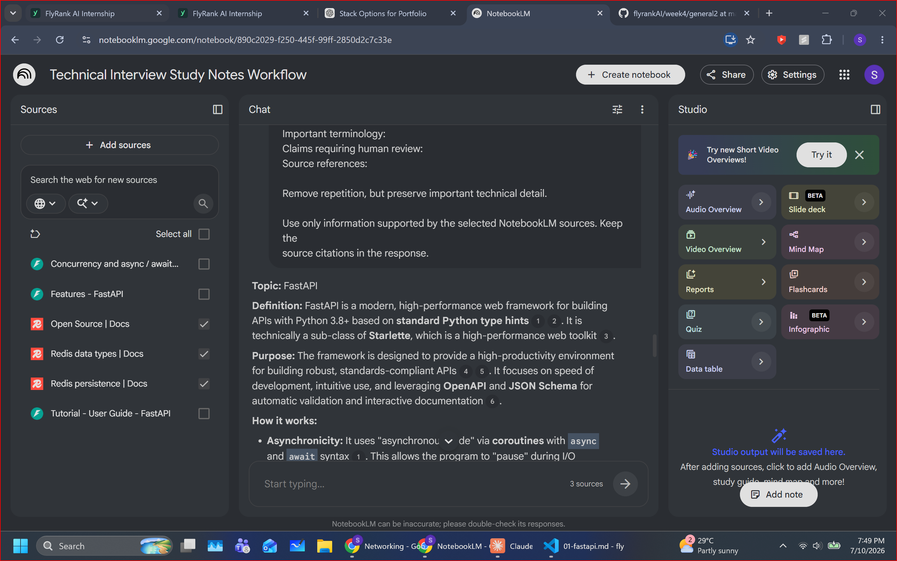
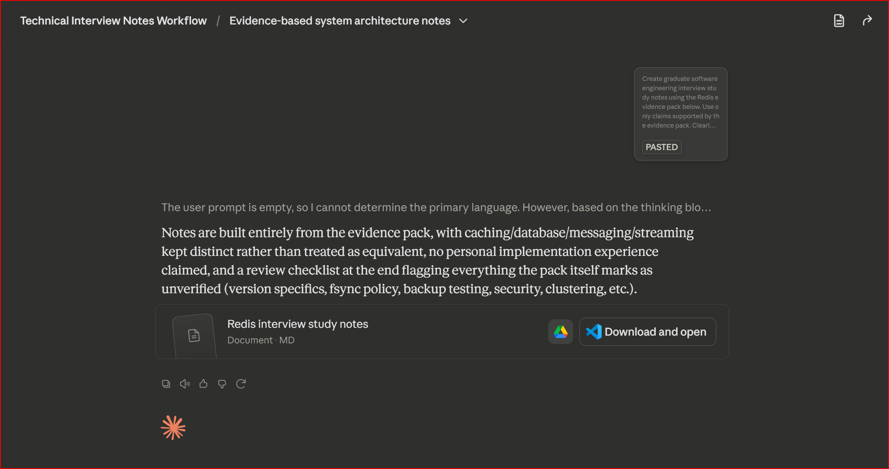
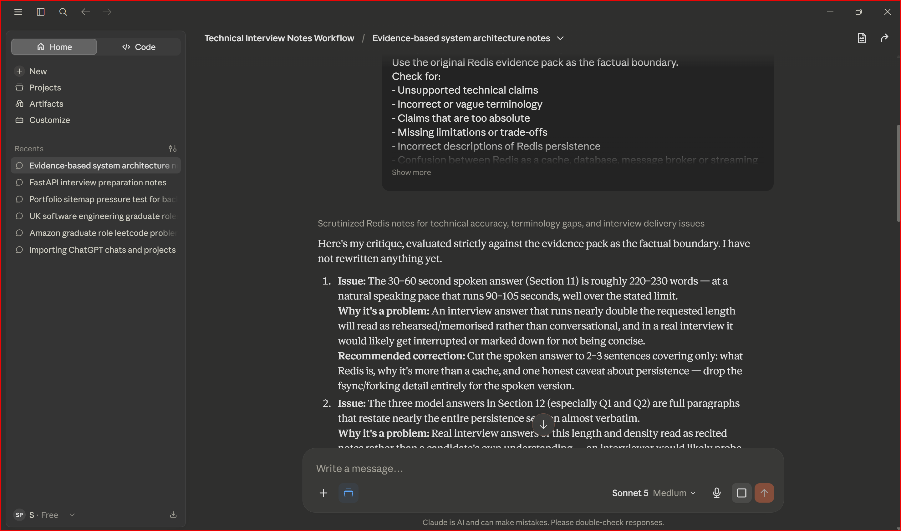

# Repair the malformed source-reference line at the end of the evidence pack.
- Redis Open Source — Get Started documentation
- Redis Data Types documentation
- Redis Persistence documentation

## Claude First Draft

# Redis Interview Study Notes — First Draft

## 1. Definition

Redis is an open-source, in-memory data store and data-structure server. It
supports native data types and atomic operations, so it can be used for more
than basic key-value string storage.

**Key phrase to remember:** Redis is a data-structure server, not just a
key-value string store — this distinction matters in interviews.

## 2. Why Redis Is Used

Redis is used where an application needs rapid access to frequently used data.
Its documented roles include:

- Caching
- Database storage
- Queuing and messaging
- Stream and event processing
- Session storage
- Leaderboards
- Document and vector storage

These roles are not identical. A cache can often be rebuilt, while Redis used
as an authoritative data store needs deliberate persistence, backup and
recovery decisions.

## 3. How It Works

Applications connect to a Redis server through a client and store values under
keys. Each key has a Redis data type, and the application issues commands
appropriate to that type. Redis keeps active data in memory and provides atomic
operations on its data types.

Persistence is optional. RDB creates point-in-time snapshots, while AOF records
write operations so Redis can replay them at startup. For some persistence
work, Redis forks a child process so the parent can continue serving requests
while background disk work takes place.

## 4. Important Data Types

| Data type | Structure | Typical fit |
|---|---|---|
| Strings | Sequences of bytes | Simple cached values and counters |
| Hashes | Field-value pairs | Record-like objects and grouped counters |
| Lists | Ordered strings | Queues and stacks |
| Sets | Unordered unique strings | Uniqueness checks and set operations |
| Sorted sets | Unique strings ordered by score | Leaderboards and priority data |
| Streams | Ordered event entries | Event processing and append-only logs |
| JSON | Hierarchical arrays and objects | Structured or nested documents |
| Vector sets | High-dimensional vectors | Similarity search |
| Probabilistic structures | Approximate statistical structures | Membership or cardinality estimation |

## 5. Common Use Cases

### Caching

Redis can store frequently reused data so an application does not repeatedly
retrieve or calculate it.

### Database storage

Redis can be used as a database, but the design must account for memory usage,
persistence, backups and acceptable data loss.

### Messaging and queuing

Lists can support queue-like workflows, while streams can store and distribute
ordered event records. These are separate from simple caching.

### Stream processing

Streams support append-oriented event data and consumption patterns.

### Document and vector storage

Redis documentation also describes JSON, document and vector use cases, though
the detailed indexing and search behaviour requires separate verification.

## 6. Persistence Options

### No persistence

Redis can be configured without persistence. This may be suitable for
replaceable cache data, but a restart can remove all data held only in that
instance.

### RDB snapshots

RDB creates point-in-time snapshots at configured intervals. Snapshot files are
compact and can support backups and recovery. However, changes since the latest
completed snapshot may be lost after an unexpected failure. Snapshot creation
uses process forking, which can introduce overhead for large datasets.

### AOF

AOF records write operations and replays them during startup. Redis supports
different `fsync` policies, including every write, every second and no explicit
Redis-managed `fsync`. The selected policy changes the balance between
performance and potential data loss. AOF files are generally larger than RDB
files and can be rewritten in the background.

### RDB and AOF together

Both mechanisms can be enabled. This can combine snapshots with a write log,
but it adds operational and storage complexity.

## 7. Practical Example

A web application could use Redis for short-lived session information. A
session ID could act as the key, while a string or hash could contain the
session data. The design would still need decisions about expiry, whether the
data can be rebuilt, whether persistence is necessary and what happens when
Redis is unavailable.

A separate example is a ranking table. A sorted set could store members with
scores so they remain ordered.

These examples are illustrative and are not complete production designs.

## 8. Advantages

- Active data is stored in memory for rapid access.
- Redis supports several data structures rather than only plain strings.
- Atomic operations can simplify concurrent updates to individual data
  structures.
- It can support caching, database, messaging and stream-processing roles.
- Persistence is configurable rather than fixed to one strategy.
- Replication is supported.

## 9. Limitations and Trade-offs

- In-memory data consumes RAM, so capacity and growth must be managed.
- Redis is not automatically the correct primary database for every system.
- RDB has a data-loss window between snapshots.
- AOF durability and performance depend on its `fsync` policy.
- AOF files are generally larger than equivalent RDB files.
- Forking can create overhead for large datasets.
- No-persistence configurations can lose all Redis-only data after a restart.
- Detailed production security, clustering and high availability are outside
  this evidence pack.

## 10. Common Mistakes and Misconceptions

- Redis is only a cache.
- Redis stores only strings.
- In-memory means Redis cannot persist data.
- Enabling persistence guarantees zero data loss.
- AOF is always better than RDB.
- Replication and persistence solve the same problem.
- Every Redis data type can be used interchangeably.
- Redis as a cache, database, message broker and streaming engine means the
  same thing.

## 11. 30-to-60-Second Interview Answer

Redis is an open-source, in-memory data store and data-structure server that
supports native types such as strings, hashes, lists, sets, sorted sets, streams
and JSON. It is commonly used for caching because keeping active data in memory
can provide rapid access, but it can also support database storage, queues,
messaging, event processing, leaderboards, documents and vector workloads.
Applications connect through a Redis client, store data under keys and issue
commands specific to each value type. Redis also offers optional persistence.
RDB takes periodic snapshots, while AOF records writes and can use different
fsync settings to trade performance for durability. The two mechanisms can be
combined. However, persistence does not guarantee zero data loss, replication
does not replace backups, and in-memory storage means RAM usage must be managed.
For example, I might use a hash for session data or a sorted set for a
leaderboard, while deciding separately whether the data is disposable or needs
persistence and recovery controls.

## 12. Likely Interview Questions

### Q1. What is the difference between RDB and AOF?

RDB creates point-in-time snapshots at configured intervals, which produces a
compact file and can provide relatively fast restarts. The trade-off is that
changes made after the most recent completed snapshot may be lost. AOF records
write commands and replays them at startup. With the every-second fsync policy,
it can reduce the likely data-loss window compared with periodic snapshots, but
the files are generally larger and the persistence work can be slower depending
on the policy. Redis can use both mechanisms, though that adds complexity, and
neither option removes the need for backups and tested recovery procedures.

### Q2. Is Redis only a cache?

No. Redis is frequently used for caching, but the official documentation also
describes it as a database, message broker, streaming engine, document database
and vector database. Those roles have different durability and data-modelling
requirements. Cache data may be disposable and reconstructed from another
system, while Redis used as authoritative storage needs deliberate persistence,
backup and recovery controls. Messaging and streams involve communication and
event records rather than simply reusing a cached value.

### Q3. How would you choose a Redis data type?

I would choose based on the operations and structure the application needs.
Strings are appropriate for simple byte values and counters, hashes for grouped
field-value data, lists for ordered queue-like values, sets for uniqueness,
sorted sets for score-ordered collections, and streams for append-oriented
events. JSON is relevant to nested document data, while vector sets are
relevant to similarity search. I would treat those as rules of thumb rather
than strict prescriptions and confirm the detailed requirements before making a
design decision.

## 13. Human Review Checklist

- Verify the Redis version and product edition.
- Check the actual persistence configuration and `fsync` policy.
- Test backup and recovery procedures separately.
- Verify security, access control, clustering and failover from additional
  official sources.
- Treat the session and ranking examples as illustrative only.
- Avoid claiming personal implementation experience unless it is genuine.
- Benchmark performance for the actual workload rather than using general
  claims.
"""

critique = r"""
## Claude Critique

### Critique of Redis Study Notes

1. **Issue:** The 30–60 second spoken answer is roughly 220–230 words and would
   likely take well over one minute to deliver.  
   **Why it is a problem:** A long answer can sound memorised and may be
   interrupted in a real interview.  
   **Recommended correction:** Reduce it to two or three natural sentences
   covering the definition, the fact that Redis is more than a cache, and one
   persistence caveat.

2. **Issue:** The three model answers are dense paragraphs that repeat large
   parts of the persistence and data-type sections.  
   **Why it is a problem:** They read like reference material rather than
   natural spoken answers.  
   **Recommended correction:** Limit each answer to three to five concise
   sentences, leaving details such as individual `fsync` policies for
   follow-up questions.

3. **Issue:** The statement that the data-structure-server distinction
   “matters in interviews” is editorial commentary rather than evidence about
   Redis.  
   **Why it is a problem:** It encourages memorising a phrase instead of
   understanding the concept.  
   **Recommended correction:** Remove the interview commentary and define a
   data-structure server directly.

4. **Issue:** “Data-structure server” is used prominently but is not defined.  
   **Why it is a problem:** A graduate candidate might repeat the term without
   being able to explain it.  
   **Recommended correction:** Define it as a server that provides native
   structured data types and operations on those types.

5. **Issue:** `fsync` appears several times without a definition.  
   **Why it is a problem:** A candidate may use the term without understanding
   what it does.  
   **Recommended correction:** Define it on first use as an operating-system
   operation that requests buffered data be written to durable storage.

6. **Issue:** There is no dedicated terminology section despite the use of
   terms such as key, value, atomic operation, snapshot and durability.  
   **Why it is a problem:** The notes do not prepare the candidate for direct
   definition questions.  
   **Recommended correction:** Add a short terminology section using the
   evidence pack.

7. **Issue:** The data-type table labels its recommendations as “Typical fit,”
   which can sound prescriptive.  
   **Why it is a problem:** The source material treats data-type choices as
   rules of thumb rather than universal rules.  
   **Recommended correction:** Rename the column and use qualified language
   such as “can support” or “may be suitable for.”

8. **Issue:** The advantages section omits document and vector storage even
   though those roles are mentioned elsewhere.  
   **Why it is a problem:** This creates a minor internal inconsistency.  
   **Recommended correction:** Include those documented roles while noting
   that their detailed search and indexing behaviour needs separate
   verification.

9. **Issue:** The limitations section does not clearly restate that AOF and
   other persistence mechanisms do not replace backups and recovery testing.  
   **Why it is a problem:** A reader may incorrectly equate persistence with a
   complete backup strategy.  
   **Recommended correction:** Add an explicit “persistence is not backup”
   limitation.

10. **Issue:** The ranking-table example is much less developed than the
    session example.  
    **Why it is a problem:** The examples appear to carry unequal explanatory
    weight.  
    **Recommended correction:** Add a short explanation of the score and
    ordering behaviour, while keeping it illustrative.

11. **Issue:** The illustrative-only caution is not repeated near the spoken
    and model answers.  
    **Why it is a problem:** A candidate could present an example as a
    production design or personal implementation.  
    **Recommended correction:** Add a nearby reminder that examples are
    templates and must be adapted to genuine experience.

12. **Issue:** Verification caveats appear only at the end of the document.  
    **Why it is a problem:** Detailed persistence statements may be read or
    repeated before the reader sees the warning.  
    **Recommended correction:** Add brief verification notes beside
    version-specific or configuration-specific claims.

13. **Issue:** JSON and document storage are not explicitly connected.  
    **Why it is a problem:** The reader may treat them as unrelated facts.  
    **Recommended correction:** State that JSON is relevant to document-style
    storage while detailed indexing and query behaviour requires separate
    verification.

14. **Issue:** No personal-experience exaggeration was found.  
    **Why it is worth noting:** The examples remain conditional and
    illustrative rather than claiming work that was not established.  
    **Recommended correction:** Keep that cautious phrasing in the final
    version.
"""

final_output = r"""
## Final Revised Output

# Redis Interview Study Notes

## Definition

Redis is an in-memory data store and data-structure server. A data-structure
server provides native structured types—such as strings, hashes, lists, sets,
sorted sets and streams—together with operations designed for those types.

## Why It Is Used

Redis is commonly used when an application needs rapid access to structured
data. Its documented roles include:

- Caching
- Database storage
- Queues and messaging
- Event and stream processing
- Session storage
- Leaderboards
- Document and vector storage

These roles have different requirements. Disposable cache data may be rebuilt
from another system, whereas authoritative data needs deliberate persistence,
backup and recovery decisions.

## How It Works

Applications connect to Redis through a client, store data under keys and issue
commands appropriate to each value type. Redis keeps active data in memory and
provides atomic operations on its native data structures.

Redis can optionally persist data to durable storage through RDB snapshots,
AOF logging, both mechanisms together, or no persistence. Persistence settings
must be selected according to the acceptable balance between performance,
resource use and potential data loss.

## Important Data Types

| Data type | Structure | Example suitability |
|---|---|---|
| Strings | Sequences of bytes | Can support cached values and counters |
| Hashes | Field-value pairs | Can represent record-like objects |
| Lists | Ordered strings | May support stacks and queue-like workflows |
| Sets | Unordered unique strings | Can support uniqueness and set operations |
| Sorted sets | Unique strings ordered by score | Can support rankings and priority-ordered data |
| Streams | Ordered entries | Can support append-oriented event processing |
| JSON | Hierarchical arrays and objects | Relevant to nested document-style storage |
| Vector sets | High-dimensional vectors | Relevant to similarity-search use cases |
| Probabilistic structures | Approximate statistical structures | Can support approximate membership or cardinality tasks |

These are rules of thumb, not strict prescriptions. The correct choice depends
on the required operations, memory use and access patterns.

## Common Use Cases

### Caching

Redis can hold reusable data so an application avoids repeated retrieval or
computation. The design should specify expiry, eviction and what happens when
the cache is unavailable.

### Database storage

Redis can act as a database, but durability is not automatic. The design must
address persistence, backups, recovery, memory limits and acceptable data loss.

### Messaging and queues

Lists, streams and other structures can support communication and queue-like
workflows. Messaging requirements should not be treated as identical to basic
caching.

### Stream processing

Streams store ordered event entries and support event-oriented consumption
patterns.

### Document and vector storage

JSON is relevant to document-style storage, while vector sets are relevant to
similarity search. Detailed indexing, query and search behaviour requires
separate verification against the current Redis documentation.

## Persistence Options

### No persistence

Redis can run without writing data to disk. This may be suitable for
replaceable cache data, but a restart or failure can remove all data held only
by that instance.

### RDB snapshots

RDB creates point-in-time snapshots at configured intervals.

**Advantages:**

- Compact snapshot files
- Useful for backup and disaster-recovery workflows
- Potentially faster restarts for large datasets than replaying an AOF log

**Trade-offs:**

- Changes after the most recent completed snapshot may be lost
- Snapshot creation uses process forking, which can add overhead for large
  datasets

### AOF

AOF records write operations and replays them during startup.

`fsync` is an operating-system operation that requests buffered data be written
to durable storage. Redis can use different `fsync` policies, such as every
write, every second, or no explicit Redis-managed `fsync`.

**Advantages:**

- Can reduce the potential data-loss window compared with less frequent
  snapshots
- Supports background log rewriting

**Trade-offs:**

- AOF files are generally larger than equivalent RDB files
- Performance and potential data loss depend on the configured `fsync` policy

### RDB and AOF together

Both mechanisms can be enabled. This combines snapshots with a write log but
adds storage, operational and recovery complexity.

**Important:** Persistence is not a backup strategy by itself. Backups,
restore procedures and disaster-recovery tests are still required.

## Practical Example

### Session data

A web application could use a session ID as a Redis key and a string or hash as
the value. Before treating that as a production design, the team would still
need to decide:

- Whether the session can be reconstructed
- How long it should live
- Whether persistence is required
- What happens when Redis is unavailable
- Whether another system is the authoritative source

### Ranking table

A sorted set could store each member with a numerical score. Redis keeps the
members ordered by score, which can support ranking-style retrieval. The design
would still need to define how scores are updated, what ties mean and whether
the ranking data must survive a failure.

Both examples are illustrative templates, not claims about a completed personal
implementation or complete production designs.

## Advantages

- Active data is held in memory for rapid access.
- Native data types can model counters, records, queues, unique collections,
  rankings and event streams.
- Atomic commands can simplify updates to individual structures.
- Redis can support caching, database, messaging, stream, document and vector
  roles.
- Persistence is configurable.
- Replication is available.

## Limitations and Trade-offs

- Memory capacity and dataset growth must be managed.
- Redis is not automatically the right primary database for every system.
- RDB can lose changes made after the latest completed snapshot.
- AOF durability and performance depend on its `fsync` policy.
- AOF normally uses more storage than equivalent RDB snapshots.
- Background persistence work can create resource overhead.
- Disabling persistence can result in complete loss of Redis-only data after a
  restart or failure.
- Persistence and replication do not replace independent backups and tested
  recovery procedures.
- Production security, clustering, monitoring and failover require additional
  design and current official guidance.

## Important Terminology

- **Key:** The identifier used to locate a Redis value.
- **Value:** The data stored under a key, with a Redis data type.
- **Data-structure server:** A server offering native structured types and
  operations on those types.
- **Atomic operation:** An individual operation completed without another
  operation observing a partially completed state.
- **Snapshot:** A point-in-time representation of the dataset.
- **AOF:** Append Only File persistence, which records write operations.
- **RDB:** Snapshot-based Redis Database persistence.
- **`fsync`:** An operating-system request to flush buffered data to durable
  storage.
- **Durability:** The extent to which acknowledged data survives failures.
- **Replication:** Copying data from one Redis instance to another; it is not
  the same as persistence or backup.

## Common Mistakes and Misconceptions

- **“Redis is only a cache.”** It also supports database, messaging, stream,
  document and vector use cases.
- **“Redis stores only strings.”** It provides several native data types.
- **“In-memory means no persistence.”** Redis offers RDB and AOF persistence.
- **“Persistence guarantees zero data loss.”** Every configuration has
  trade-offs and possible failure windows.
- **“AOF is always better.”** Its value depends on durability needs,
  performance requirements and recovery design.
- **“Replication is a backup.”** Replication and backup address different
  risks.
- **“All data types are interchangeable.”** Each type provides different
  structure and operations.
- **“All Redis roles are the same.”** Caching, database storage, messaging and
  stream processing have different requirements.

## 30-to-60-Second Interview Answer

Redis is an in-memory data store and data-structure server. It is commonly used
for caching, but it also supports database, messaging and stream-processing
use cases through types such as hashes, lists, sorted sets and streams. Redis
can persist data with RDB snapshots or AOF logging, but the right choice depends
on the application's performance needs and tolerance for data loss, and
persistence still does not replace backups.

This is a template explanation and should be adapted to genuine project
experience before being used in an interview.

## Likely Interview Questions

### What is the difference between RDB and AOF?

RDB creates periodic point-in-time snapshots, so changes after the latest
snapshot may be lost. AOF records writes and can reduce the potential
data-loss window, but it generally uses more storage and its performance
depends on the `fsync` policy. Some systems use both, but backups and recovery
tests are still needed.

### Is Redis only a cache?

No. Caching is a common use, but Redis also supports database storage,
messaging, streams, documents and vectors. The important point is that those
roles need different persistence, recovery and data-modelling decisions.

### How would you choose a Redis data type?

I would start from the operations the application needs. For example, hashes
can represent record-like data, sets can support uniqueness, sorted sets can
support rankings and streams can support ordered event records. I would treat
those as starting points and confirm memory, access-pattern and durability
requirements before deciding.

The answers above are templates. Any practical example should be adapted to
genuine experience and described as illustrative unless it has actually been
implemented.

## Human Review Checklist

- Verify the Redis version and product edition.
- Check the actual persistence and `fsync` configuration.
- Confirm acceptable data-loss windows with the application requirements.
- Test backup, restore and disaster-recovery procedures.
- Review current Redis security, authentication and network guidance.
- Verify clustering, replication and failover behaviour separately.
- Benchmark the real workload instead of using general performance claims.
- Test any code or configuration before use.
- Adapt examples to genuine personal experience.
"""

human_review = r"""
## Human Review

### Checks Completed

- Confirmed that Redis is described as more than only a cache.
- Confirmed that caching, database storage, messaging and stream processing are
  treated as separate architectural roles.
- Confirmed that strings, hashes, lists, sets, sorted sets, streams and JSON are
  described at an appropriate graduate-interview level.
- Confirmed that RDB and AOF are distinguished clearly.
- Confirmed that persistence is not presented as guaranteeing zero data loss.
- Confirmed that replication is not described as a replacement for backups.
- Confirmed that the practical examples are illustrative rather than
  production-ready designs.
- Confirmed that the final spoken answer is short enough to deliver naturally.
- Confirmed that no unsupported personal-experience claim is included.

### Manual Corrections Still Required Before Interview Use

- Verify the Redis version and edition relevant to the role or project.
- Check the real persistence and `fsync` configuration before discussing a
  deployment.
- Review current security, authentication and clustering guidance separately.
- Adapt the session example to my genuine Redis-backed session and caching
  experience.
- Practise explaining RDB and AOF in my own words.
- Avoid precise performance claims without workload-specific benchmarks.

### Run Result

The Redis workflow completed successfully through source gathering, synthesis,
first-draft generation, technical critique, final revision and human review.

## Timing

| Activity | Time |
|---|---:|
| Finding and importing Redis sources | 7 minutes |
| NotebookLM gather stage | 6 minutes |
| NotebookLM synthesis stage | 5 minutes |
| Claude first draft | 7 minutes |
| Claude critique and revision | 10 minutes |
| Human review and documentation | 10 minutes |
| **Total Run 2 time** | **45 minutes** |

### Manual Comparison

Estimated time to research the Redis documentation and create equivalent
structured notes manually:

**Approximately 85 minutes**

Estimated execution time saved:

**85 minutes - 45 minutes = 40 minutes**

The initial workflow setup cost was recorded under Run 1 and was not repeated
for this run.

## Evidence

