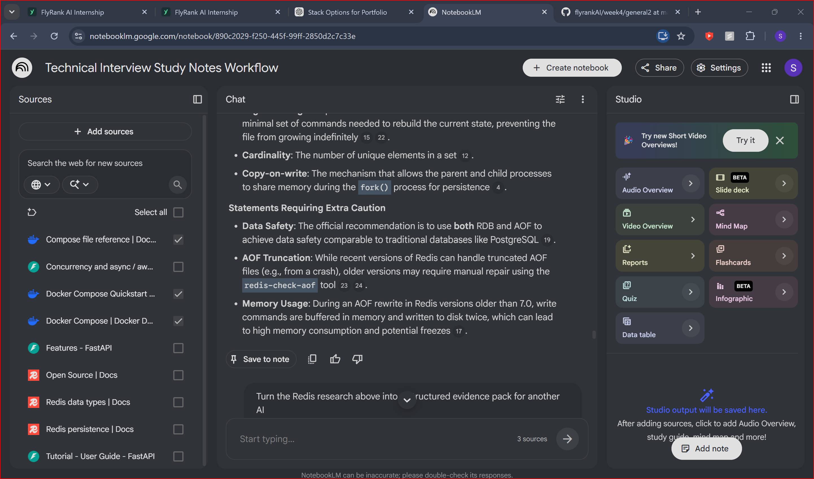
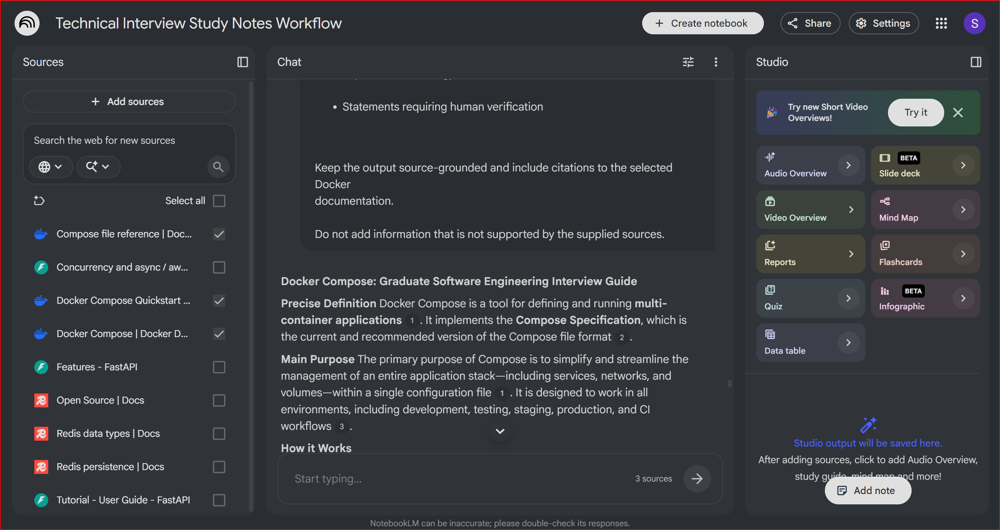
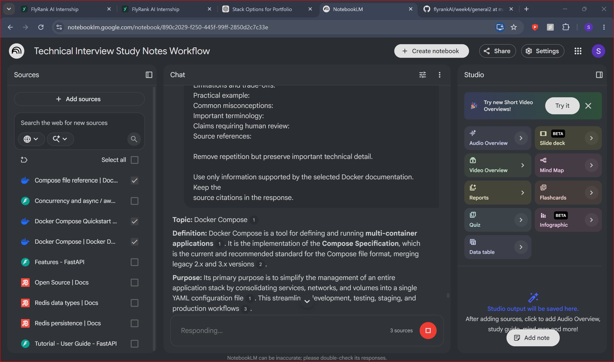
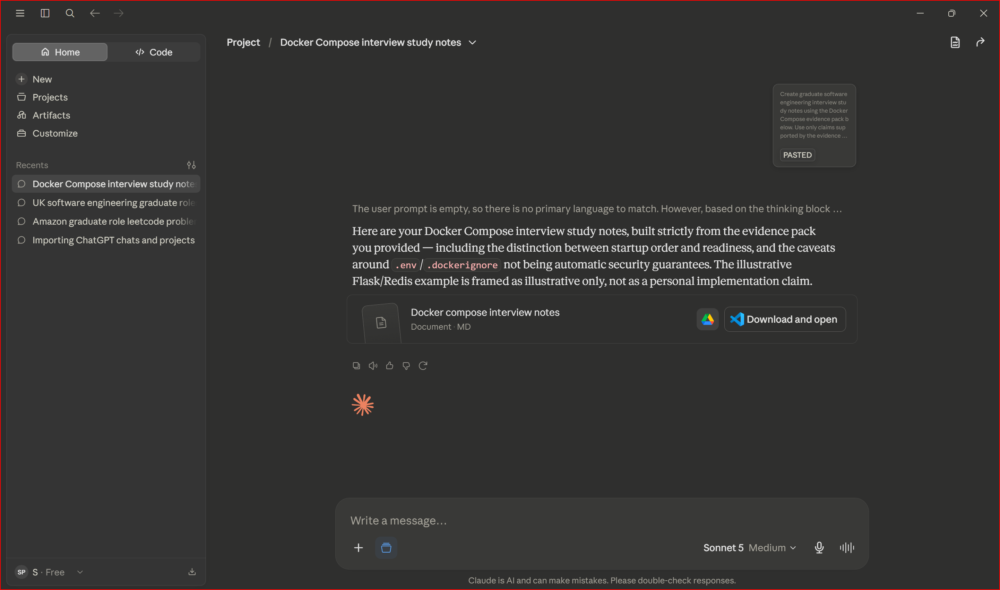
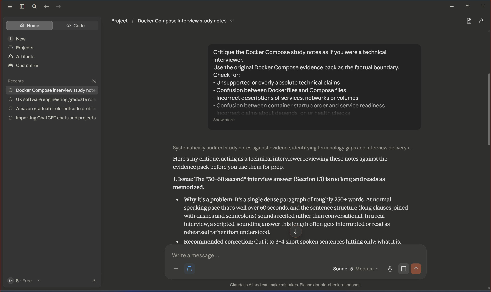
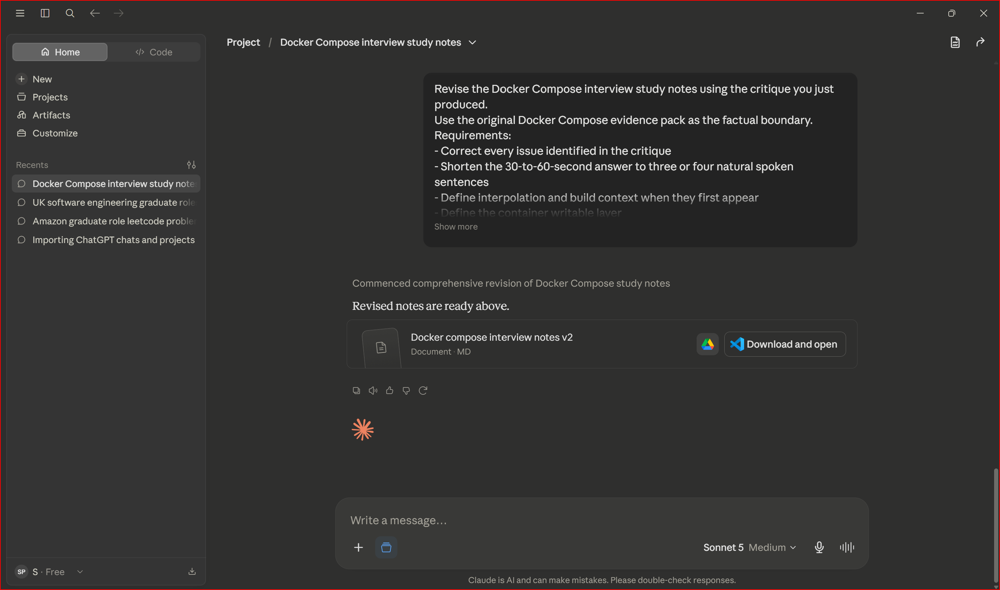

# Run 3: Docker Compose

## Input

Docker Compose

## Sources

- Docker Compose overview
- Docker Compose Quickstart
- Compose file reference

## Gather Output

### Docker Compose: Graduate Software Engineering Interview Guide

**Precise Definition**
Docker Compose is a tool for defining and running **multi-container applications**. It implements the **Compose Specification**, which is the current and recommended version of the Compose file format.

**Main Purpose**
The primary purpose of Compose is to simplify and streamline the management of an entire application stack—including services, networks, and volumes—within a single configuration file. It is designed to work in all environments, including development, testing, staging, production, and CI workflows.

**How it Works**
*   **YAML Configuration**: Developers define the application's components in a `compose.yaml` (or `docker-compose.yaml`) file.
*   **Single-Command Deployment**: With one command (e.g., `docker compose up`), the tool creates and starts all the services defined in the configuration.
*   **Lifecycle Management**: It handles the entire application lifecycle, providing commands to start, stop, rebuild, and view the status of services.

**Important Concepts and Components**
*   **Services**: These are the computing components of the application, often defined by a `Dockerfile` or an image pulled from a registry like Docker Hub.
*   **Networks**: Communication channels that allow services to find and talk to each other.
*   **Volumes**: Mechanisms for **persisting data** outside of the container's temporary writable layer.
*   **Compose Specification**: The latest standard that merged legacy 2.x and 3.x versions into a unified format.

**Structure of a Compose File**
A Compose file is organized into top-level elements:
*   **`services`**: Attributes for defining containerized tasks.
*   **`networks`**: Attributes for defining communication channels.
*   **`volumes`**: Attributes for persistent storage.
*   **`configs` and `secrets`**: Elements for managing configuration and sensitive data.
*   **`include`**: A top-level element used to modularize applications by splitting services across multiple files.

**Services, Networks, and Volumes**
*   **Services**: Can reference images or build contexts. For example, a `web` service might build from a local directory while a `redis` service pulls a public image.
*   **Networks**: By default, Compose sets up a single network for the app. Services can reach each other using their **service name as the hostname** (e.g., the `web` container can reach `redis` using `redis:6379`).
*   **Volumes**: Named volumes (e.g., `redis-data:/data`) are registered top-level to ensure data survives even when containers are removed and recreated.

**Common Commands**
*   `docker compose up`: Builds, (re)creates, and starts the entire stack.
*   `docker compose down`: Stops and removes containers and networks.
*   `docker compose stop`: Stops containers but **preserves** them so data survives in the writable layer.
*   `docker compose config`: Resolves environment variables and merges files to show the final configuration to be applied.
*   `docker compose exec`: Runs a command inside a running container for live debugging.
*   `docker compose logs -f`: Streams and interleaves log output from all services.

**Common Use Cases**
*   **Local Development**: Using features like **Compose Watch** to automatically sync code changes into running containers.
*   **Modular Applications**: Using `include` to let different teams own separate parts of a complex stack while keeping them part of the same application.
*   **CI/CD**: Streamlining the setup of testing environments that mirror production.

**Advantages**
*   **Efficiency**: Replaces complex multi-step `docker run` commands with a single configuration.
*   **Configuration Portability**: Uses `.env` files for **interpolation**, allowing developers to change values across environments without editing the YAML.
*   **Clean Environments**: The `.dockerignore` file keeps builds fast and avoids baking secrets or unnecessary build artifacts into image layers.

**Limitations and Trade-offs**
*   **Startup Races**: Services start at the same time. If a web app starts before its database is ready, it may crash. This is mitigated using **health checks** and the `depends_on` logic.
*   **Data Ephemerality**: Without volumes, data written to a container is lost during a `docker compose down`.

**Common Mistakes or Misconceptions**
*   **Assuming Persistence**: Relying on `docker compose stop` for data persistence is a mistake in production, as containers are frequently replaced; **named volumes** must be used instead.
*   **Volume Deletion**: Running `docker compose down -v` will **permanently delete** all data in named volumes.
*   **Dockerfile Naming**: Editors sometimes add `.txt` to a `Dockerfile`, which causes builds to fail.

**Practical Multi-Container Example**
A common example is a **Python Flask web application with a Redis hit counter**. The `compose.yaml` defines a `web` service built from a local directory and a `redis` service using a public image. To ensure stability, a **healthcheck** is added to Redis (running `redis-cli ping`), and the `web` service is configured to wait until Redis is healthy before starting.

**Important Terminology**
*   **Interpolation**: Substituting placeholders (e.g., `${APP_PORT}`) in the YAML with values from environment files.
*   **Health Check**: A specific test command run inside a container to verify its readiness.
*   **Compose Watch**: A development feature that monitors the host filesystem to sync files or rebuild images automatically.
*   **Service Discovery**: Automatic networking where containers use service names as hostnames for communication.

**Statements Requiring Human Verification**
*   **Variable Resolution**: Always use `docker compose config` to manually verify that environment variables and merged files have resolved as intended.
*   **Security Defaults**: While the quickstart app uses "sensible defaults," these must be reviewed to ensure they meet specific production security standards.
*   **Secrets Exposure**: Verify that `.dockerignore` and `.env` handling are correctly configured to prevent accidentally committing secrets to version control.

## Synthesised Evidence Pack

**Topic:** Docker Compose

**Definition:** Docker Compose is a tool for defining and running **multi-container applications**. It is the implementation of the **Compose Specification**, which is the current and recommended standard for the Compose file format, merging legacy 2.x and 3.x versions.

**Purpose:** Its primary purpose is to simplify the management of an entire application stack by consolidating services, networks, and volumes into a single YAML configuration file. This streamlines development, testing, staging, and production workflows.

**How it works:**
*   **YAML Configuration:** Developers define the app's components in a `compose.yaml` (or `docker-compose.yaml`) file.
*   **Unified Deployment:** With a single command (`docker compose up`), the tool creates and starts all services defined in the configuration.
*   **Lifecycle Management:** It manages the entire application lifecycle, including starting, stopping, rebuilding, and viewing the status of services.

**Compose file structure:** The file is organized into top-level elements, most notably `services`, `networks`, and `volumes`. It also supports `configs`, `secrets`, and the `include` element for modularization.

**Key components:**
*   **Services:** The individual computing components (containers) of the application.
*   **Networks:** Communication channels that allow services to find and communicate with each other.
*   **Volumes:** Mechanisms for storing **persistent data** outside of a container's ephemeral writable layer.

**Services:** Each service is defined by either an image pulled from a registry (like Docker Hub) or an image built from a local **Dockerfile**. Attributes include port mapping (host-to-container), health checks, and dependencies on other services.

**Networks:** By default, all services in a Compose file share a network, enabling **service discovery** where containers use service names as hostnames for communication.

**Volumes:** **Named volumes** are registered as top-level elements to ensure data persists across `down` and `up` cycles, where regular container data would otherwise be lost.

**Common commands:**
*   `docker compose up`: Builds, (re)creates, and starts the entire application stack.
*   `docker compose down`: Stops and removes containers and networks.
*   `docker compose stop`: Stops containers but **preserves** them, allowing data in the writable layer to survive.
*   `docker compose config`: Resolves environment variables and merges included files to show the **fully resolved configuration**.
*   `docker compose exec`: Runs a command inside a running container, primarily used for live debugging.
*   `docker compose logs -f`: Streams and interleaves color-coded log output from all services.

**Common use cases:**
*   **Local Development:** Facilitating multi-container setups and live code syncing via **Compose Watch**.
*   **Modular Applications:** Using the `include` element to split a complex stack into multiple files owned by different teams.
*   **CI/CD:** Creating consistent environments for testing and deployment that mirror production.

**Advantages:**
*   **Portability:** Using `.env` files for **interpolation** allows configuration changes across environments without editing the YAML.
*   **Build Efficiency:** The `.dockerignore` file prevents secrets and unnecessary artifacts from being baked into image layers, keeping builds fast.
*   **Modular Architecture:** The `include` and `merge` features allow for reusing infrastructure definitions across different projects.

**Limitations and trade-offs:**
*   **Startup Races:** services start simultaneously by default; if a web app starts before its database is ready, it may crash. This requires mitigation using **health checks**.
*   **Data Ephemerality:** Unless named volumes are used, data written to a container is permanently lost when the container is removed (e.g., via `docker compose down`).

**Practical example:** A **Python Flask web application with a Redis hit counter**. The configuration defines a `web` service (built locally) and a `redis` service (pulled from Docker Hub). A health check (`redis-cli ping`) is added to the Redis service to ensure it is healthy before the web service attempts to connect.

**Common misconceptions:**
*   **Persistence:** Relying on `docker compose stop` for data persistence is not recommended for production; **named volumes** are the standard for survival through container replacements.
*   **Naming:** Editors may accidentally add `.txt` to a `Dockerfile`, which will cause the build to fail.

**Important terminology:**
*   **Interpolation:** Substituting placeholders in the YAML with values from environment files.
*   **Compose Watch:** A development feature that monitors the host filesystem to automatically sync changes or rebuild images.
*   **Compose Bridge:** A tool to transform Compose files into configurations for other platforms, such as Kubernetes.

**Claims requiring human review:**
*   **Variable Substitution:** Developers should always run `docker compose config` to verify that environment variables have been resolved as intended.
*   **Security:** While default setups are described as having "sensible defaults," these must be manually reviewed to ensure secrets are not committed to version control or baked into images.
*   **Data Deletion:** Running `docker compose down -v` will **permanently delete** all data in named volumes.

## Claude Critique

### Critique of Docker Compose Interview Notes

1. **Issue:** The 30-to-60-second interview answer is significantly too long.  
   **Why it is a problem:** At more than approximately 250 words, it would exceed one minute at a normal speaking pace and may sound rehearsed rather than conversational.  
   **Recommended correction:** Reduce it to three or four short sentences covering what Docker Compose is, why it is useful, one practical feature and one limitation.

2. **Issue:** Some terminology is used before it is defined, including interpolation and build context.  
   **Why it is a problem:** A graduate candidate may repeat these terms without being able to explain them clearly.  
   **Recommended correction:** Define each term briefly on first use or refer the reader directly to the terminology section.

3. **Issue:** The term “container writable layer” is used but not defined.  
   **Why it is a problem:** Understanding the writable layer is important for explaining why data can disappear when a container is removed and why volumes are needed.  
   **Recommended correction:** Define it as temporary storage specific to a container that is removed with the container.

4. **Issue:** `configs` and `secrets` are listed as Compose file elements but are not explained.  
   **Why it is a problem:** Their inclusion may imply that the notes fully cover them even though the evidence pack contains little detail.  
   **Recommended correction:** Briefly define them or clearly mark them as features requiring separate verification.

5. **Issue:** The acronyms YAML and CI are not expanded.  
   **Why it is a problem:** This is inconsistent with the document’s otherwise careful terminology definitions.  
   **Recommended correction:** Explain YAML as a human-readable configuration-data format and expand CI as continuous integration on first use.

6. **Issue:** The model answer explaining `depends_on` and service readiness is too dense for spoken delivery.  
   **Why it is a problem:** The technical distinction is accurate, but the long sentence would be difficult to say naturally during an interview.  
   **Recommended correction:** Split it into two or three shorter sentences: `depends_on` controls ordering, a health check verifies readiness, and `condition: service_healthy` can connect the two.

7. **Issue:** The personal-experience warning for the Flask and Redis example is too far from the example itself.  
   **Why it is a problem:** A reader may accidentally present the generic example as something they personally built.  
   **Recommended correction:** Add an inline statement directly below the example explaining that it is illustrative and must only be presented as personal work if genuinely implemented.

### Review Strengths

No significant problems were found with:

- The distinction between Dockerfiles and Compose files
- Services, networks and named volumes
- Startup order versus readiness
- `depends_on` and health-check behaviour
- `docker compose stop`, `down` and `down -v`
- The handling of `.env` and `.dockerignore`
- Unsupported personal-experience claims

## Evidence

## Final Revised Output

Paste the complete contents of docker-compose-interview-notes-v2 here.

## Human Review

### Checks Completed

- Confirmed that Docker Compose is described as a tool for defining and running multi-container applications.
- Confirmed that services, networks and volumes are distinguished.
- Confirmed that startup order is separated from service readiness.
- Confirmed that depends_on does not by itself guarantee readiness.
- Confirmed that named volumes survive a normal docker compose down.
- Confirmed that docker compose down -v can remove named-volume data.
- Confirmed that interpolation, build context, writable layer, YAML and CI are defined.
- Confirmed that the Flask and Redis example is labelled illustrative.
- Confirmed that production security, backups, secrets and resource controls remain subject to human review.

### Manual Corrections Still Required

- Verify the installed Docker Compose version.
- Verify support for include and other version-dependent features.
- Test health checks and dependency conditions against a real application.
- Run docker compose config to inspect resolved configuration.
- Verify secret handling, volume backups and recovery behaviour.
- Do not present the illustrative example as personal experience unless genuinely implemented.

### Run Result

The workflow completed from source gathering through synthesis, drafting,
critique, revision and human review.

## Timing

| Activity | Time |
|---|---:|
| Finding and importing sources | Not separately recorded |
| NotebookLM gather stage | Not separately recorded |
| NotebookLM synthesis stage | Not separately recorded |
| Claude first draft | Not separately recorded |
| Claude critique and revision | Not separately recorded |
| Human review and documentation | Not separately recorded |
| **Total Run 3 time** | **Not calculable from the available records** |

The timing record is intentionally honest. No retrospective figures were
invented.