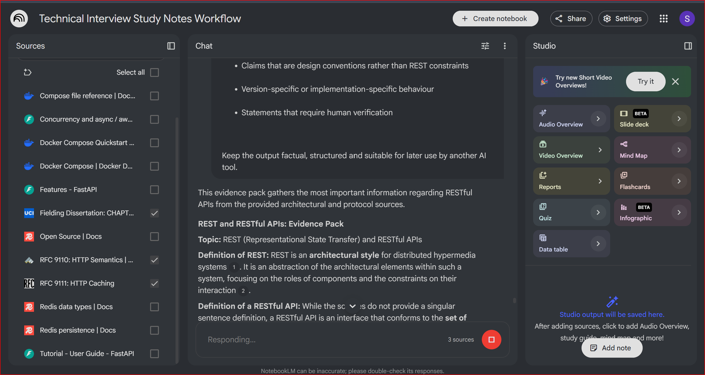
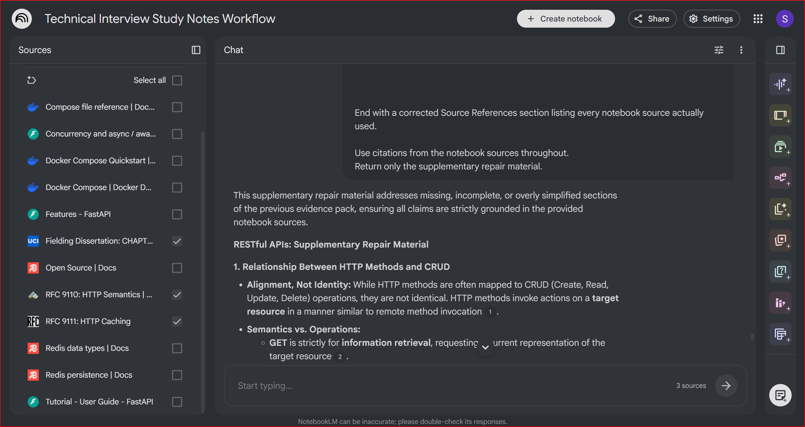
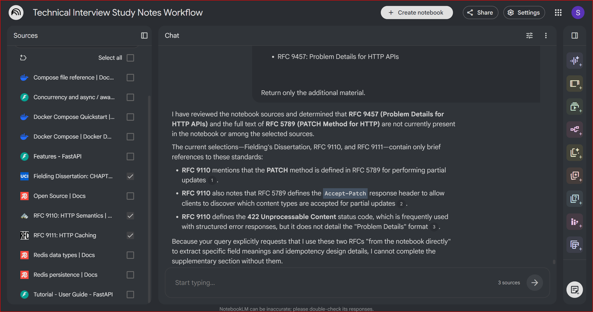
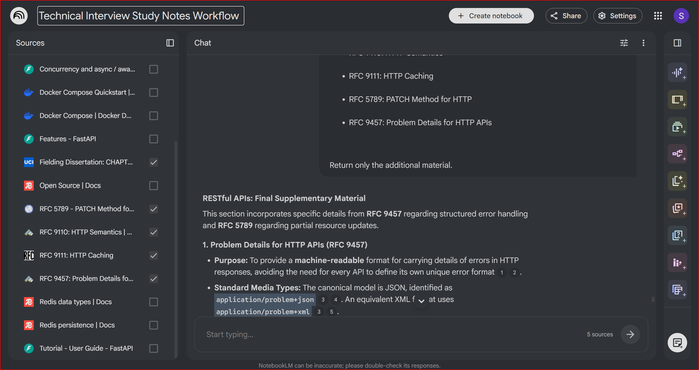
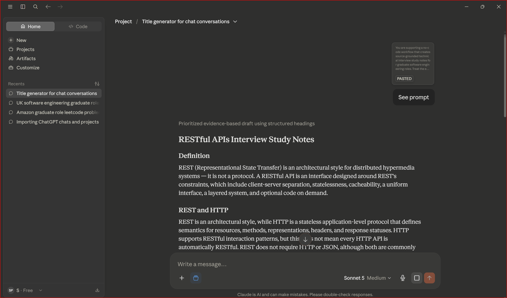
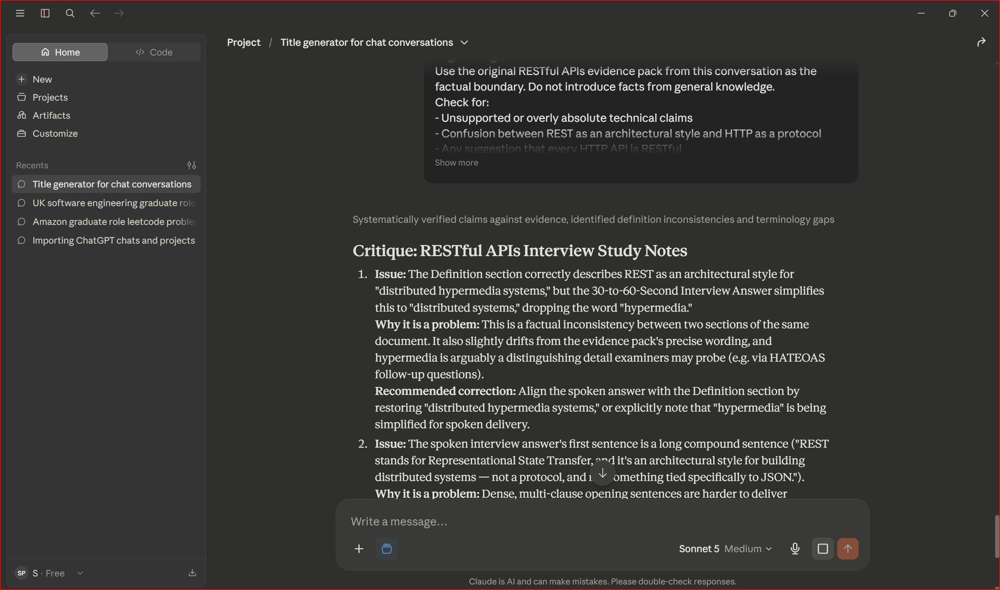
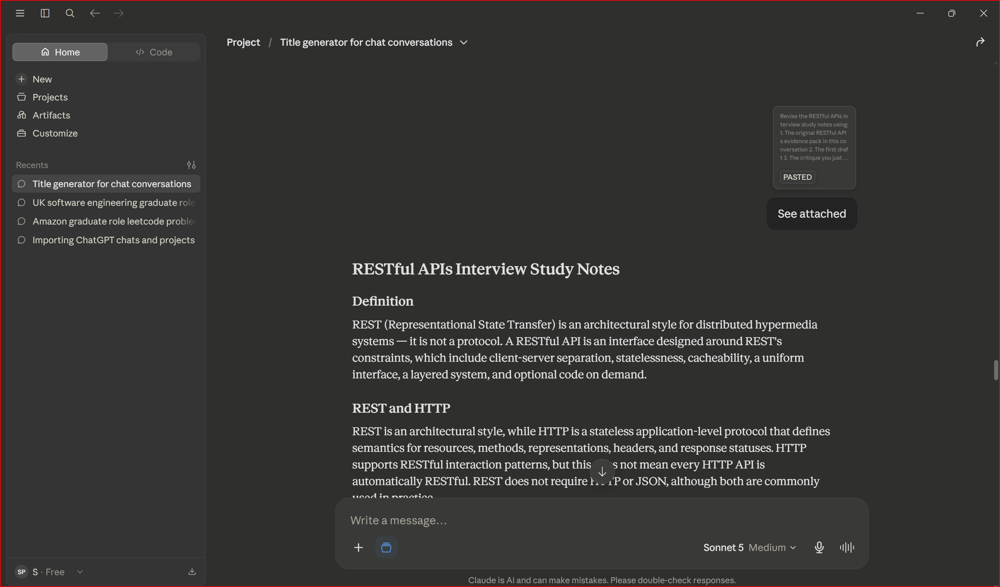

# Run 4: RESTful APIs

## Input

RESTful APIs

## Sources

- Roy Fielding — Representational State Transfer, Chapter 5
- RFC 9110 — HTTP Semantics
- RFC 9111 — HTTP Caching
- RFC 5789 — PATCH Method for HTTP
- RFC 9457 — Problem Details for HTTP APIs

## Gather Output

### REST and RESTful APIs: Evidence Pack

**Topic:** REST (Representational State Transfer) and RESTful APIs

**Definition of REST:** REST is an **architectural style** for distributed
hypermedia systems. It abstracts the architectural elements within such a
system, focusing on component roles and constraints on their interactions.

**Definition of a RESTful API:** A RESTful API is an interface designed to
conform to REST's architectural constraints so that the system can gain
properties such as scalability, evolvability, visibility and reliability.

### REST and HTTP

- **REST** is an architectural style: a set of constraints. It is not itself a
  protocol and does not require one specific transfer protocol.
- **HTTP** is a family of stateless application-level protocols. HTTP supports
  many of the interaction semantics used by RESTful systems, but an HTTP API is
  not automatically RESTful merely because it uses HTTP.

### Why RESTful APIs Are Used

REST's constraints are intended to support properties such as:

- Scalability through simplified server components and separation of concerns
- Independent evolution and deployment of components
- Portability of user interfaces across platforms
- Visibility of interactions
- Reliability and recovery from partial failures
- A uniform interface that simplifies the overall system architecture

### REST Architectural Constraints

- **Client-server:** Separates user-interface concerns from data-storage
  concerns, improving portability and allowing components to evolve
  independently.
- **Statelessness:** Each request must contain the information needed to
  understand it. The server does not rely on stored session context from
  previous requests. This does **not** mean that the server stores no
  application data.
- **Cacheability:** Responses indicate whether they can be reused. A cache may
  reuse a response for a later equivalent request when the response remains
  fresh or is successfully validated.
- **Uniform interface:** REST's central constraint. It includes:
  - Identification of resources
  - Manipulation of resources through representations
  - Self-descriptive messages
  - Hypermedia as the engine of application state (HATEOAS)
- **Layered system:** A component normally interacts only with its immediate
  layer, allowing intermediaries such as proxies and gateways.
- **Code on demand, optional:** A server may extend client functionality by
  sending executable code such as scripts.

### Resources, Identifiers and Representations

- A **resource** is any information that can be named, including documents,
  images and time-dependent services.
- A **resource identifier**, commonly a URI, identifies the resource involved
  in an interaction.
- A **representation** captures the current or intended state of a resource. It
  consists of data plus representation metadata describing how the data should
  be interpreted.
- REST does not require JSON. Representations can use different media types,
  including HTML, image formats, JSON or XML.

### Requests, Responses, Headers and Content

- HTTP is a request-response protocol for exchanging messages.
- **Headers** are name-value fields that carry control data and metadata about
  the sender, message or content.
- A **message body**, or content, is the sequence of bytes sent after the header
  section and can contain a complete or partial representation.
- Representation metadata such as `Content-Type` and `Content-Language` helps a
  recipient interpret the content.

### HTTP Methods

- **GET:** Requests transfer of a current selected representation of the target
  resource. GET is safe and idempotent.
- **POST:** Requests that the target resource process the enclosed
  representation according to that resource's own semantics. This can include
  creating a resource, appending data or submitting data to a process. POST is
  neither safe nor idempotent.
- **PUT:** Requests that the state of the target resource be created or
  replaced by the state described in the enclosed representation. PUT is
  idempotent but not safe.
- **PATCH:** Requests that a set of changes described by a patch document be
  applied to the target resource. PATCH is intended for partial modification,
  is not safe and is not inherently idempotent.
- **DELETE:** Requests removal of the association between the target URI and
  its current functionality. It does not necessarily imply physical deletion
  of all underlying stored data. DELETE is idempotent but not safe.

### Safety, Idempotency and Cacheability

- A **safe method** is intended for information retrieval rather than a
  requested state change. GET, HEAD, OPTIONS and TRACE are defined as safe.
- An **idempotent method** has the same intended effect when the same request is
  made multiple times as when it is made once. PUT, DELETE and safe methods are
  idempotent.
- Safety and idempotency are different properties: an idempotent method can
  still change server state.
- Cacheability is a separate property controlled by HTTP method semantics,
  response metadata, freshness information and cache directives.

### Status-Code Classes

- **1xx — Informational:** The request was received and processing continues.
- **2xx — Successful:** The request was successfully received, understood and
  accepted.
- **3xx — Redirection:** Further action is required to complete the request.
- **4xx — Client error:** The request contains a client-side problem or cannot
  be fulfilled as submitted.
- **5xx — Server error:** The server failed to fulfil an apparently valid
  request.

### Important Status Codes

- **200 OK:** General successful completion; the response content depends on
  the method.
- **201 Created:** The request succeeded and created one or more resources.
- **202 Accepted:** The request was accepted for processing, but processing is
  not complete.
- **204 No Content:** The request succeeded and there is no additional response
  content.
- **400 Bad Request:** The server cannot process the request because of a
  perceived client error such as malformed syntax, invalid framing or
  deceptive routing.
- **401 Unauthorized:** The request lacks valid authentication credentials.
  The response includes an authentication challenge through
  `WWW-Authenticate`.
- **403 Forbidden:** The server understood the request but refuses to fulfil
  it. The reason may relate to permissions, but it does not have to be related
  to credentials.
- **404 Not Found:** The server did not find a current representation of the
  resource or is unwilling to disclose that it exists.
- **405 Method Not Allowed:** The method is known but not supported for the
  target resource.
- **409 Conflict:** The request conflicts with the resource's current state.
- **422 Unprocessable Content:** The content type and syntax are understood,
  but the contained instructions cannot be processed.
- **500 Internal Server Error:** An unexpected server condition prevented
  fulfilment.
- **502 Bad Gateway:** A gateway or proxy received an invalid response from an
  inbound server.
- **503 Service Unavailable:** The server is temporarily unable to handle the
  request, such as during overload or maintenance.
- **504 Gateway Timeout:** A gateway or proxy did not receive a timely response
  from an upstream server.

### URI and Resource Design

REST requires resources to be identified. The naming authority, normally the
origin server, is responsible for maintaining meaningful mappings between
identifiers and resources.

Common practices such as plural nouns, `/v1/` prefixes, pagination parameters,
nesting rules and particular path shapes are **design conventions**, not
universal REST constraints.

### Validation and Error Handling

- A malformed or incorrectly framed request may lead to `400 Bad Request`.
- A syntactically correct request whose instructions cannot be processed may
  lead to `422 Unprocessable Content`.
- This is not a universal prescription for every API. The exact validation
  rules and status-code choices are implementation decisions that should be
  documented consistently.
- Error responses commonly include a representation describing the error and
  possible corrective action.

### Authentication, Authorisation and Security

- **Authentication** establishes or verifies identity using credentials.
- **Authorisation** determines whether the requester is permitted to perform an
  action.
- `401` concerns missing or invalid authentication credentials.
- `403` means that the server refuses the request; this can be related to
  permissions but does not have to be credential-related.
- REST itself does not supply authentication, authorisation or encryption.
  These concerns depend on the API's security mechanisms and the underlying
  transport, such as HTTPS/TLS.

### HTTP Caching

- A cache stores previous responses for possible reuse.
- Freshness is determined from the response's age and freshness lifetime.
- Validators such as ETags and `Last-Modified` dates can be used to check
  whether a stored response is still valid.
- Caching can improve efficiency and reduce repeated work, but incorrect cache
  behaviour can serve stale or inappropriate content and requires careful
  configuration.

### API Versioning

Versioning can distinguish different resource variants or revisions, such as a
specific version and a latest version. URI prefixes, headers and other
versioning approaches are design conventions rather than defining REST
requirements.

### Advantages and Trade-offs

**Advantages:**

- Scalability
- Visibility of interactions
- Reliability
- Independent deployment and evolution
- Portability
- A uniform interface that reduces architectural variation

**Trade-offs:**

- Statelessness can increase repetitive request data and network overhead.
- A uniform interface can be less efficient than a specialised interface.
- Layered systems can add latency and processing overhead.
- REST constraints support desirable properties, but they do not automatically
  make a particular implementation secure, scalable or production-ready.

### Mistakes and Misconceptions

- **REST is a protocol.** Incorrect: REST is an architectural style.
- **Every HTTP API is RESTful.** Incorrect: an API must satisfy relevant REST
  constraints, not merely use HTTP.
- **REST only means using GET, POST, PUT, PATCH and DELETE.** Incorrect: method
  choice is only one part of the wider architectural style.
- **REST and CRUD are identical.** Incorrect: CRUD describes data operations,
  while HTTP methods have protocol-defined semantics.
- **Statelessness means the server stores no data.** Incorrect: it means the
  server does not depend on stored session context between requests.
- **POST is only for creating resources.** Incorrect: POST asks the target
  resource to process the content according to its own semantics.
- **PUT means changing selected fields.** Incorrect: PUT requests creation or
  replacement of the selected resource state.
- **PATCH is always idempotent.** Incorrect: idempotency depends on the patch
  format and implementation.
- **Every successful request returns 200.** Incorrect: other success codes
  include 201, 202 and 204.
- **401 means insufficient permission and 403 means missing credentials.**
  Incorrect: 401 concerns valid authentication credentials, while 403 means
  the server refuses to fulfil the request.
- **REST requires JSON.** Incorrect: REST works through representations and
  media types.
- **REST automatically supplies security.** Incorrect: authentication,
  authorisation and encryption are separate concerns.
- **URI naming and versioning conventions are universal REST rules.**
  Incorrect: many such patterns are design conventions.

### Illustrative Example

A purchase transaction could be submitted with POST. The server could return a
receipt representation and a `Content-Location` header identifying a URI from
which that representation can later be retrieved with GET.

This is an illustrative protocol example, not evidence of a personal
implementation or a complete production design.

### Important Terminology

- **REST:** Representational State Transfer; an architectural style for
  distributed hypermedia systems.
- **Resource:** Information that can be identified and interacted with.
- **URI:** Uniform Resource Identifier; an identifier used to refer to a
  resource.
- **Representation:** Data and metadata representing a resource's current or
  intended state.
- **Media type:** Metadata describing the format and interpretation of content.
- **Uniform interface:** REST constraint that standardises interactions between
  components.
- **HATEOAS:** Hypermedia as the Engine of Application State.
- **Safe:** A method intended for read-only semantics.
- **Idempotent:** Repeating an identical request has the same intended effect as
  making it once.
- **ETag:** A validator associated with a representation version.
- **Content negotiation:** Selection of a representation based on available
  formats and client preferences.
- **Proactive negotiation:** The server selects a representation using client
  preferences such as the `Accept` header.
- **Reactive negotiation:** The server provides alternatives and the client
  selects one.

### Claims Requiring Human Verification

- Whether a specific API's PATCH operation is intended to be idempotent
- Which patch-document media types the API supports
- Which authentication schemes and authorisation rules the API applies
- How the implementation distinguishes `400` and `422`
- Which media type and fields are used for structured error responses
- The API's URI, pagination, nesting and versioning conventions
- Production limits on URI and header-field sizes
- Cache-control rules and validator behaviour for the actual endpoints
- Whether examples correspond to genuine personal implementation experience

### Gather Output Supplement and Corrections

#### Relationship Between HTTP Methods and CRUD

HTTP methods and CRUD operations are related but not identical:

- GET can support retrieval, but its HTTP meaning is requesting a selected
  representation.
- POST can support creation, but its semantics are broader resource-specific
  processing.
- PUT can create or replace the state of the selected resource.
- PATCH applies a set of partial changes.
- DELETE removes the association between the URI and its current functionality,
  which does not necessarily mean erasing all underlying data.

The mapping depends on the resource model and API design, so it should not be
treated as a universal one-to-one correspondence.

#### PATCH and PUT

PUT requests complete creation or replacement of selected resource state.
PATCH applies a set of changes described by a patch document.

PATCH is neither safe nor inherently idempotent. Its idempotency depends on the
patch-document semantics and server implementation. A patch that sets a value
to a fixed value can be idempotent, while a patch that increments a value might
not be.

#### Validation: 400 and 422

`400 Bad Request` can represent malformed syntax, invalid framing or another
perceived client error. `422 Unprocessable Content` represents content whose
type and syntax are understood but whose instructions cannot be processed.

These meanings do not require every API to use exactly the same validation
policy. The target API's documented behaviour must be verified.

#### Authentication and Authorisation

Authentication establishes identity through credentials. Authorisation
determines whether an operation is permitted.

`401` indicates that valid authentication credentials are missing. `403`
indicates that the server refuses to fulfil the request, and the refusal can be
unrelated to credentials.

REST itself does not provide authentication, authorisation or encryption.

#### Resource-Oriented URI Design

REST requires resource identification but does not prescribe universal naming
rules such as plural nouns, a `/v1/` prefix, a particular pagination format or
a fixed nesting structure.

#### Content Negotiation and Media Types

REST does not require JSON. A representation is interpreted through metadata
such as `Content-Type` and `Content-Language`.

With proactive negotiation, the server selects a representation using client
preferences such as `Accept`. With reactive negotiation, the server exposes
alternatives and the client chooses one.

### Workflow Break Observed

NotebookLM could not complete the requested PATCH and Problem Details analysis
because RFC 5789 and RFC 9457 had not initially been imported into the
notebook.

This required human intervention to identify and add the missing primary
sources. The model correctly avoided inventing unsupported details.

### Final Gather Repair: PATCH and Problem Details

#### Problem Details for HTTP APIs

RFC 9457 defines a machine-readable format for carrying error details in HTTP
responses so that each API does not need to invent a completely unrelated
error format.

Its standard media types include:

- `application/problem+json`
- `application/problem+xml`

Standard members include:

- **`type`:** A URI reference identifying the problem type. When absent, it
  defaults to `about:blank`.
- **`title`:** A short human-readable summary of the problem type.
- **`status`:** The HTTP status code for the occurrence. It is advisory; the
  actual response status remains authoritative to generic HTTP software.
- **`detail`:** A human-readable explanation specific to the occurrence.
- **`instance`:** A URI reference identifying the particular occurrence.

All standard members are optional, and applications can define extension
members for problem-specific information. Clients are expected to tolerate
extensions they do not understand.

Problem Details is a standard error representation, not a defining REST
architectural constraint. Error responses must be reviewed to prevent leakage
of stack traces, internal file paths, database details or other sensitive
implementation information.

#### PATCH

RFC 5789 defines PATCH as applying a set of changes, represented in a patch
document, to the target resource.

PATCH differs from PUT because PUT requests creation or complete replacement of
selected resource state, while PATCH applies incremental changes.

PATCH is not safe and is not inherently idempotent. A PATCH operation can be
designed to be idempotent when its patch-document semantics and implementation
produce the same result when repeated.

Patch documents use a media type that defines how the changes should be
interpreted. A server can advertise supported patch-document media types with
the `Accept-Patch` response header.

PATCH can use conditional requests, particularly a strong ETag in an
`If-Match` header, to reduce the risk of conflicting updates and lost changes.

#### Additional Human Verification

- Verify the patch-document media types accepted by the target API.
- Verify whether its PATCH operations are intended to be idempotent.
- Verify the Problem Details media type and members exposed.
- Verify that error responses do not reveal sensitive implementation details.
- Verify authentication, validation and versioning conventions.
- Verify that the actual HTTP response status and any Problem Details `status`
  member remain consistent.

### Source References

- Fielding Dissertation, Chapter 5
- RFC 9110: HTTP Semantics
- RFC 9111: HTTP Caching
- RFC 5789: PATCH Method for HTTP
- RFC 9457: Problem Details for HTTP APIs

## Synthesised Evidence Pack

**Topic:** RESTful APIs

**Definition:**  
REST, or Representational State Transfer, is an architectural style for
distributed hypermedia systems. A RESTful API is an interface designed around
REST's constraints, including client-server separation, stateless interaction,
cacheability, a uniform interface, layered components and optional code on
demand.

**Purpose:**  
REST is intended to support properties such as scalability, visibility,
portability, reliability and independent component evolution. Its uniform
interface reduces architectural variation, while stateless interactions and
layering allow components and intermediaries to operate with reduced coupling.

**REST and HTTP:**  

- REST is an architectural style, not a protocol.
- HTTP is a stateless application-level protocol with semantics for resources,
  methods, representations, headers and response statuses.
- HTTP supports RESTful interaction patterns, but an HTTP API is not
  automatically RESTful.
- REST does not require HTTP or JSON, although HTTP and JSON are commonly used
  in practical APIs.

**Architectural constraints:**  

- **Client-server:** Separates user-interface concerns from server-side data and
  processing concerns.
- **Statelessness:** Each request contains the information required to process
  it. The server does not depend on session context retained from previous
  requests. The server can still store application and resource data.
- **Cacheability:** Responses communicate whether and how they may be reused.
- **Uniform interface:** Standardises interactions through resource
  identification, manipulation through representations, self-descriptive
  messages and HATEOAS.
- **Layered system:** Components normally interact only with the adjacent layer,
  enabling intermediaries such as proxies and gateways.
- **Code on demand, optional:** A server may extend client functionality by
  transferring executable code.

**Resources, identifiers and representations:**  

- A resource is information that can be named.
- A URI identifies the resource involved in an interaction.
- A representation contains data and metadata describing a resource's current
  or intended state.
- Representation metadata such as `Content-Type` tells recipients how to
  interpret the content.
- REST can use different media types and does not require JSON.

**Requests, responses, headers and content:**  

- HTTP exchanges request and response messages.
- Headers carry control information and metadata.
- Message content contains a complete or partial representation.
- Content negotiation allows a representation to be selected based on
  available formats and client preferences.

**HTTP methods:**

- **GET:** Requests a current selected representation. Safe and idempotent.
- **POST:** Requests resource-specific processing of the enclosed content. It
  can create a resource but is not limited to creation. Neither safe nor
  idempotent.
- **PUT:** Requests that selected resource state be created or completely
  replaced. Idempotent but not safe.
- **PATCH:** Requests application of a set of changes described by a patch
  document. Not safe and not inherently idempotent.
- **DELETE:** Requests removal of the association between the target URI and
  its current functionality. Idempotent but not safe; it does not necessarily
  imply physical deletion of all stored data.

**Safety, idempotency and cacheability:**  

- Safe methods are intended for information retrieval rather than requested
  state change.
- Idempotent methods have the same intended effect when an identical request is
  repeated.
- GET is safe and idempotent.
- PUT and DELETE are idempotent but not safe.
- POST is neither safe nor idempotent.
- PATCH is neither safe nor inherently idempotent.
- Cacheability is separate from safety and idempotency. It depends on method
  semantics, response metadata, freshness and cache directives.

**Relationship between HTTP methods and CRUD:**  

HTTP methods and CRUD are related but not identical. CRUD describes data
operations, while HTTP defines semantics for interacting with a target
resource. GET often supports reading, POST can support creation, PUT can support
creation or replacement, PATCH can support partial modification and DELETE can
support removal. These are useful associations, not universal one-to-one rules.

**Status-code classes:**  

- 1xx: informational
- 2xx: successful
- 3xx: redirection
- 4xx: client error
- 5xx: server error

**Important status codes:**  

- `200 OK`: general successful completion
- `201 Created`: one or more resources were created
- `202 Accepted`: accepted for processing, but processing is incomplete
- `204 No Content`: succeeded with no additional response content
- `400 Bad Request`: malformed syntax, invalid framing or another perceived
  client error
- `401 Unauthorized`: valid authentication credentials are missing
- `403 Forbidden`: the server refuses to fulfil the request
- `404 Not Found`: no current representation was found or disclosed
- `405 Method Not Allowed`: the method is not supported by the target resource
- `409 Conflict`: conflict with current resource state
- `422 Unprocessable Content`: syntax and content type are understood, but the
  instructions cannot be processed
- `500 Internal Server Error`: unexpected server condition
- `502 Bad Gateway`: invalid response from an inbound server
- `503 Service Unavailable`: temporary overload or maintenance
- `504 Gateway Timeout`: no timely response from an upstream server

**URI and resource design:**  

REST requires resources to be identified, and the naming authority is
responsible for maintaining meaningful identifier mappings. Conventions such
as plural nouns, path nesting, `/v1/` prefixes and pagination shapes are common
API design choices, not universal REST constraints.

**Validation and error handling:**  

- `400` can represent malformed syntax, invalid framing or another perceived
  client error.
- `422` can represent syntactically valid content whose instructions cannot be
  processed.
- APIs must document their validation rules consistently; REST does not impose
  one universal `400` versus `422` policy.
- Error responses can include representations that explain the condition and
  help clients respond appropriately.

**Problem Details:**  

RFC 9457 provides a machine-readable standard for HTTP API error
representations.

Standard media types include `application/problem+json` and
`application/problem+xml`.

The standard members are:

- `type`: URI reference identifying the problem type; defaults to
  `about:blank` when absent
- `title`: short human-readable summary of the problem type
- `status`: advisory copy of the HTTP response status
- `detail`: explanation specific to the occurrence
- `instance`: URI reference identifying the occurrence

All members are optional. APIs can add extension members. Problem Details is an
error-representation standard, not a REST architectural constraint. Error
content must be reviewed to avoid exposing sensitive implementation details.

**Authentication, authorisation and transport security:**  

- Authentication establishes or verifies identity.
- Authorisation determines whether an action is allowed.
- `401` concerns missing or invalid authentication credentials and includes an
  authentication challenge.
- `403` means the server refuses to fulfil the request and does not always imply
  a particular credential state.
- REST itself does not provide authentication, authorisation or encryption.
- APIs require separate security mechanisms and a protected transport such as
  HTTPS/TLS where appropriate.

**HTTP caching:**  

Caches store previous responses for potential reuse. Freshness is determined
from response age and freshness lifetime. Validators such as ETags and
`Last-Modified` can be used to revalidate stored responses. Caching can reduce
latency and repeated server work, but incorrect directives or validation can
serve stale or inappropriate data.

**API versioning:**  

Versioning distinguishes different resource or interface variants. URI
prefixes, request headers and other versioning approaches are design
conventions rather than REST constraints. The strategy must be selected and
documented for the target API.

**Advantages:**  

- Supports scalability-oriented separation of concerns
- Enables independent component evolution and deployment
- Improves interaction visibility
- Supports caching and intermediaries
- Promotes portability and architectural consistency
- Can improve reliability and recovery from partial failures

**Limitations and trade-offs:**  

- Stateless requests can repeat contextual data and increase network overhead.
- A uniform interface can be less efficient than a specialised interface.
- Layering can add latency and processing overhead.
- Incorrect caching can serve stale or inappropriate content.
- PATCH operations can create update conflicts if concurrency is not handled.
- API versioning, validation, security and error formats require separate
  design decisions.
- REST constraints support desirable properties but do not automatically make
  an API scalable, secure or production-ready.

**Practical example:**  

An illustrative purchase endpoint could accept POST content for processing and
return a receipt representation. A `Content-Location` header could identify a
URI from which that representation can later be retrieved with GET.

A separate illustrative PATCH operation could update part of an order using a
defined patch-document media type. A strong ETag with `If-Match` could reduce
the risk of overwriting a concurrent update.

These are protocol examples, not claims of personal implementation experience
or complete production designs.

**Common misconceptions:**  

- REST is a protocol.
- Every HTTP API is RESTful.
- REST is only a mapping of CRUD to HTTP methods.
- Statelessness means the server stores no data.
- POST is only for creation.
- PUT means partial update.
- PATCH is automatically idempotent.
- DELETE necessarily erases all underlying data.
- Every successful request returns `200`.
- `401` means permission was denied and `403` means credentials are missing.
- REST requires JSON.
- Problem Details is a REST constraint.
- REST automatically provides authentication, encryption, scalability or
  production readiness.
- URI naming, pagination and versioning patterns are universal REST rules.

**Important terminology:**  

- REST
- Resource
- URI
- Representation
- Representation metadata
- Media type
- Uniform interface
- HATEOAS
- Safe method
- Idempotent method
- Cache
- Freshness
- Validator
- ETag
- Content negotiation
- Patch document
- `Accept-Patch`
- Conditional request
- Problem type
- Problem Details

**Claims requiring human review:**  

- Whether the target API satisfies the REST constraints it claims to follow
- The supported media types and content-negotiation behaviour
- Authentication and authorisation mechanisms
- Transport-security configuration
- Validation policy and use of `400` versus `422`
- Problem Details media type, members and extensions
- Whether error responses expose sensitive information
- PATCH document formats and idempotency behaviour
- Conditional update and concurrency controls
- Cache directives, validators and handling of authenticated content
- URI, pagination, nesting and versioning conventions
- Production limits for URIs and header fields
- Whether illustrative examples match genuine personal experience

**Process observation:**  

The initial gather stage did not include RFC 5789 or RFC 9457, so NotebookLM
could not produce the requested PATCH and Problem Details evidence. Human
intervention was required to import the missing primary sources before the
evidence pack could be completed. This is a workflow failure point and not
technical evidence about REST.

**Source references:**  

- Fielding Dissertation, Chapter 5
- RFC 9110: HTTP Semantics
- RFC 9111: HTTP Caching
- RFC 5789: PATCH Method for HTTP
- RFC 9457: Problem Details for HTTP APIs

## Claude First Draft

# RESTful APIs Interview Study Notes

## Definition

REST (Representational State Transfer) is an architectural style for distributed hypermedia systems — it is not a protocol. A RESTful API is an interface designed around REST's constraints, which include client-server separation, statelessness, cacheability, a uniform interface, a layered system, and optional code on demand.

## REST and HTTP

REST is an architectural style, while HTTP is a stateless application-level protocol that defines semantics for resources, methods, representations, headers, and response statuses. HTTP supports RESTful interaction patterns, but this does not mean every HTTP API is automatically RESTful. REST does not require HTTP or JSON, although both are commonly used in practice.

## Why RESTful APIs Are Used

REST is intended to support properties such as scalability, visibility, portability, reliability, and independent evolution of components. Its uniform interface reduces architectural variation, and statelessness combined with layering allows components and intermediaries to operate with reduced coupling between them.

## Architectural Constraints

- **Client-server**: Separates user-interface concerns from server-side data and processing concerns.
- **Statelessness**: Each request contains the information required to process it. The server does not depend on session context retained from previous requests — this does not mean the server stores no data at all; it can still store application and resource data.
- **Cacheability**: Responses indicate whether and how they may be reused.
- **Uniform interface**: Standardises interactions through resource identification, manipulation through representations, self-descriptive messages, and HATEOAS (Hypermedia as the Engine of Application State).
- **Layered system**: Components normally interact only with the adjacent layer, which enables intermediaries such as proxies and gateways.
- **Code on demand (optional)**: A server may extend client functionality by transferring executable code. This is the only optional constraint.

## Resources, URIs and Representations

A resource is information that can be named. A URI (Uniform Resource Identifier) identifies the resource involved in an interaction. A representation contains data and metadata describing a resource's current or intended state. Representation metadata such as Content-Type tells recipients how to interpret the content. REST can use different media types and does not require JSON.

## Requests and Responses

HTTP exchanges consist of request and response messages. Headers carry control information and metadata, while message content contains a complete or partial representation of a resource. Content negotiation allows a representation to be selected based on the formats available and the client's stated preferences.

## HTTP Methods

- **GET**: Requests a current selected representation. Safe and idempotent.
- **POST**: Requests resource-specific processing of the enclosed content. It can create a resource, but it is not limited to creation. Neither safe nor idempotent.
- **PUT**: Requests that selected resource state be created or completely replaced. Idempotent but not safe.
- **PATCH**: Requests application of a set of changes described by a patch document. Not safe, and not inherently idempotent.
- **DELETE**: Requests removal of the association between the target URI and its current functionality. Idempotent but not safe. It does not necessarily imply physical deletion of all stored data.

## Safety, Idempotency and Cacheability

A **safe method** is intended for information retrieval rather than requested state change. An **idempotent method** produces the same intended effect when an identical request is repeated.

- GET is safe and idempotent.
- PUT and DELETE are idempotent but not safe.
- POST is neither safe nor idempotent.
- PATCH is neither safe nor inherently idempotent.

Cacheability is a separate property from safety and idempotency. It depends on method semantics, response metadata, freshness, and cache directives.

## HTTP Methods and CRUD

HTTP methods and CRUD (Create, Read, Update, Delete) are related but not identical. CRUD describes data operations, while HTTP defines semantics for interacting with a target resource. GET often supports reading, POST can support creation, PUT can support creation or replacement, PATCH can support partial modification, and DELETE can support removal — but these are useful associations rather than universal one-to-one rules.

## HTTP Status Codes

Status codes fall into five classes: 1xx (informational), 2xx (successful), 3xx (redirection), 4xx (client error), and 5xx (server error).

Commonly relevant codes:

- **200 OK**: general successful completion
- **201 Created**: one or more resources were created
- **202 Accepted**: accepted for processing, but processing is incomplete
- **204 No Content**: succeeded with no additional response content
- **400 Bad Request**: malformed syntax, invalid framing, or another perceived client error
- **401 Unauthorized**: valid authentication credentials are missing
- **403 Forbidden**: the server refuses to fulfil the request
- **404 Not Found**: no current representation was found or disclosed
- **405 Method Not Allowed**: the method is not supported by the target resource
- **409 Conflict**: conflict with current resource state
- **422 Unprocessable Content**: syntax and content type are understood, but the instructions cannot be processed
- **500 Internal Server Error**: unexpected server condition
- **502 Bad Gateway**: invalid response from an inbound server
- **503 Service Unavailable**: temporary overload or maintenance
- **504 Gateway Timeout**: no timely response from an upstream server

Note: 401 concerns missing or invalid authentication credentials, while 403 means the server refuses to fulfil the request and does not always imply a particular credential state — these are distinct conditions.

## URI and Resource Design

REST requires that resources be identified, and the naming authority is responsible for maintaining meaningful identifier mappings. Conventions such as plural nouns, path nesting, `/v1/` prefixes, and pagination shapes are common API design choices — they are not universal REST constraints.

## Validation and Error Handling

A 400 response can represent malformed syntax, invalid framing, or another perceived client error, while a 422 response can represent syntactically valid content whose instructions cannot be processed. APIs must document their validation rules consistently, since REST does not impose one universal policy for choosing between 400 and 422. Error responses can include representations that explain the condition and help clients respond appropriately.

## Problem Details

RFC 9457 provides a machine-readable standard for HTTP API error representations. Standard media types include `application/problem+json` and `application/problem+xml`.

Standard members:

- **type**: URI reference identifying the problem type (defaults to `about:blank` when absent)
- **title**: short human-readable summary of the problem type
- **status**: advisory copy of the HTTP response status
- **detail**: explanation specific to the occurrence
- **instance**: URI reference identifying the occurrence

All members are optional, and APIs can add extension members. Problem Details is an error-representation standard, not a REST architectural constraint. Error content must be reviewed to avoid exposing sensitive implementation details.

## Authentication, Authorisation and Security

Authentication establishes or verifies identity, while authorisation determines whether a given action is allowed. A 401 status concerns missing or invalid authentication credentials and includes an authentication challenge; a 403 status means the server refuses to fulfil the request and does not always imply a particular credential state.

REST itself does not provide authentication, authorisation, or encryption. APIs require separate security mechanisms and a protected transport such as HTTPS/TLS (Transport Layer Security) where appropriate.

## HTTP Caching

Caches store previous responses for potential reuse. Freshness is determined from response age and freshness lifetime. Validators such as ETags and Last-Modified headers can be used to revalidate stored responses. Caching can reduce latency and repeated server work, but incorrect directives or validation can result in stale or inappropriate data being served.

## API Versioning

Versioning distinguishes different resource or interface variants. URI prefixes, request headers, and other versioning approaches are design conventions rather than REST constraints. The versioning strategy must be selected and documented for the target API.

## Practical Example

*The following is an illustrative example only, intended to demonstrate the protocol concepts described above. It is not a claim of personal implementation experience, nor a complete or production-ready design.*

A purchase endpoint could accept `POST` content for processing and return a receipt representation. A `Content-Location` header could identify a URI from which that representation could later be retrieved with `GET`.

A separate operation could use `PATCH` to update part of an order using a defined patch-document media type. A strong ETag combined with `If-Match` could reduce the risk of overwriting a concurrent update.

*Aspects such as validation, authentication, concurrency handling, and error formatting would need separate design and testing before any such endpoint could be considered production-ready — see the Human Review Checklist.*

## Advantages

- Supports scalability-oriented separation of concerns.
- Enables independent component evolution and deployment.
- Improves interaction visibility.
- Supports caching and intermediaries.
- Promotes portability and architectural consistency.
- Can improve reliability and recovery from partial failures.

## Limitations and Trade-offs

- Stateless requests can repeat contextual data, increasing network overhead.
- A uniform interface can be less efficient than a specialised interface.
- Layering can add latency and processing overhead.
- Incorrect caching can serve stale or inappropriate content.
- PATCH operations can create update conflicts if concurrency is not handled.
- API versioning, validation, security, and error formats each require separate design decisions.
- REST constraints support desirable properties but do not automatically make an API scalable, secure, or production-ready.

## Important Terminology

- **REST**: an architectural style for distributed hypermedia systems.
- **Resource**: information that can be named.
- **URI**: an identifier for a resource.
- **Representation**: data and metadata describing a resource's current or intended state.
- **Representation metadata**: information (such as Content-Type) describing how to interpret a representation.
- **Media type**: a format label for representation content.
- **Uniform interface**: the REST constraint standardising interactions via identification, representations, self-descriptive messages, and HATEOAS.
- **HATEOAS**: Hypermedia as the Engine of Application State — part of the uniform interface constraint.
- **Safe method**: a method intended for retrieval rather than state change.
- **Idempotent method**: a method with the same intended effect when repeated identically.
- **Cache**: a store of previous responses for potential reuse.
- **Freshness**: whether a cached response is still considered valid for reuse.
- **Validator**: a mechanism (such as an ETag) used to revalidate a stored response.
- **ETag**: a validator used in conditional requests.
- **Content negotiation**: selecting a representation based on available formats and client preference.
- **Patch document**: a document describing a set of changes for PATCH to apply.
- **Accept-Patch**: an indicator of supported patch-document formats.
- **Conditional request**: a request that applies only under specified validator conditions.
- **Problem type**: the category of error identified by a Problem Details `type` member.
- **Problem Details**: the RFC 9457 standard for machine-readable HTTP error representations.

## Common Mistakes and Misconceptions

- Believing REST is a protocol rather than an architectural style.
- Assuming every HTTP API is RESTful.
- Reducing REST to a mapping of CRUD operations onto HTTP methods.
- Believing statelessness means the server stores no data.
- Assuming POST is only used for creation.
- Believing PUT means partial update.
- Assuming PATCH is automatically idempotent.
- Assuming DELETE necessarily erases all underlying data.
- Assuming every successful request returns 200.
- Confusing 401 and 403 (401 concerns missing/invalid credentials; 403 is a refusal that does not always imply a particular credential state).
- Believing REST requires JSON.
- Treating Problem Details as a REST architectural constraint rather than an error-representation standard.
- Assuming REST automatically provides authentication, encryption, scalability, or production readiness.
- Treating URI naming, pagination, and versioning patterns as universal REST rules rather than design conventions.

## 30-to-60-Second Interview Answer

REST stands for Representational State Transfer, and it's an architectural style for building distributed systems — not a protocol, and not something tied specifically to JSON. A RESTful API follows constraints like client-server separation, statelessness, cacheability, a uniform interface, and layering, with code on demand as an optional extra. Statelessness is often misunderstood — it just means the server doesn't rely on session context from earlier requests, not that it can't store data at all. It's worth remembering, too, that REST itself doesn't automatically give you security or scalability; those still need to be designed in separately.

## Likely Interview Questions

**1. What's the difference between REST and HTTP?**
REST is an architectural style, and HTTP is a stateless protocol that happens to support RESTful patterns well. Using HTTP doesn't automatically make an API RESTful — that depends on whether it follows REST's constraints, like statelessness and a uniform interface.

**2. Is PATCH idempotent?**
Not inherently, no — unlike PUT, PATCH applies a set of changes described in a patch document, and repeating that request isn't guaranteed to produce the same result each time. That's different from GET, PUT, and DELETE, which are idempotent by definition.

**3. What's the difference between a 401 and a 403 status code?**
A 401 means valid authentication credentials are missing, so it comes with an authentication challenge. A 403 means the server is refusing to fulfil the request for other reasons, and it doesn't necessarily say anything about the state of your credentials.

**4. Does REST require JSON?**
No — REST can work with different media types, and the evidence here is clear that JSON isn't a requirement. It's just commonly used alongside HTTP in practice because it's convenient and widely supported.

**5. Does using REST automatically make an API secure or scalable?**
No. REST's constraints support properties like scalability and reliability, but they don't guarantee them — authentication, authorisation, encryption, and other production concerns still need to be designed and implemented separately.

## Human Review Checklist

AI-assisted review does not guarantee correctness, so the following should be verified by a human before relying on these notes or any related implementation:

- Whether a specific target API actually satisfies the REST constraints it claims to follow.
- Supported media types and content-negotiation behaviour for a given API.
- Authentication and authorisation mechanisms in use.
- Transport-security (HTTPS/TLS) configuration.
- Validation policy and the specific use of 400 versus 422 for a given API.
- Problem Details media type, member usage, and any extension members.
- Whether error responses risk exposing sensitive implementation details.
- PATCH document formats and actual idempotency behaviour in a given implementation.
- Conditional update and concurrency-control mechanisms (e.g. ETag/If-Match usage).
- Cache directives, validators, and handling of authenticated content.
- URI, pagination, nesting, and versioning conventions for a given API.
- Production limits for URIs and header fields.
- Whether any illustrative examples used in study or interview preparation match genuine personal experience.
- Whether the spoken answer and model answers actually fit within their intended time when read aloud.

## Claude Critique

# Critique: RESTful APIs Interview Study Notes

1. **Issue:** The Definition section correctly describes REST as an architectural style for “distributed hypermedia systems”, but the 30-to-60-Second Interview Answer simplifies this to “distributed systems”, dropping the word “hypermedia”.  
   **Why it is a problem:** This creates a factual inconsistency and drifts from the evidence pack’s precise wording. Hypermedia is also a distinguishing detail an interviewer may probe through HATEOAS.  
   **Recommended correction:** Align the spoken answer with the Definition section by restoring “distributed hypermedia systems”.

2. **Issue:** The spoken interview answer opens with a long compound sentence and sits close to the upper end of the intended time once natural pauses are included.  
   **Why it is a problem:** Dense, multi-clause sentences are harder to deliver naturally and can sound memorised.  
   **Recommended correction:** Split the opening into shorter sentences and retain a checklist item requiring the answer to be timed aloud.

3. **Issue:** The Practical Example uses `Content-Location` and `If-Match` without defining them, and neither appears in the terminology section.  
   **Why it is a problem:** A graduate candidate may repeat these terms without understanding them.  
   **Recommended correction:** Define `Content-Location` as identifying a URI from which the returned representation can later be retrieved. Define `If-Match` as making a request conditional on a validator such as a strong ETag, reducing the risk of conflicting updates.

4. **Issue:** HATEOAS is expanded but not meaningfully explained.  
   **Why it is a problem:** Expanding an acronym is not the same as demonstrating understanding, and the evidence pack only covers its role within the uniform-interface constraint.  
   **Recommended correction:** State that HATEOAS forms part of the uniform interface and flag its detailed mechanics for separate human verification.

5. **Issue:** The 401/403 distinction is repeated in full in both the status-code and security sections.  
   **Why it is a problem:** This adds density without adding new information.  
   **Recommended correction:** Explain the distinction fully once in HTTP Status Codes and cross-reference it briefly in the security section.

6. **Issue:** `HTTPS/TLS` is written with TLS expanded but HTTPS left unexplained.  
   **Why it is a problem:** Acronym handling is inconsistent.  
   **Recommended correction:** Avoid adding unsupported expansions and use `HTTPS` consistently.

7. **Issue:** The Important Terminology section is a long, flat list.  
   **Why it is a problem:** It encourages rote memorisation rather than connecting related concepts.  
   **Recommended correction:** Group terms into REST and resources, HTTP method properties, caching and conditional requests, and error handling.

8. **Issue:** The media-type definition is vague.  
   **Why it is a problem:** “A format label” does not explain how the concept is used.  
   **Recommended correction:** Define a media type as metadata describing how representation content should be interpreted, used through `Content-Type` and content negotiation.

9. **Issue:** The Practical Example does not explicitly state that the shown interaction is only one possible pattern.  
   **Why it is a problem:** A candidate might mistake it for a required REST implementation.  
   **Recommended correction:** Add a sentence saying it is one illustrative pattern among several valid approaches.

## Strengths That Should Be Preserved

- REST is consistently presented as an architectural style and not confused with HTTP.
- The notes do not imply that every HTTP API is RESTful.
- CRUD and HTTP methods are correctly treated as related but non-identical.
- PATCH is consistently described as not inherently idempotent.
- DELETE is correctly described as not necessarily implying physical deletion.
- The 401/403 distinction is technically accurate.
- RFC 9457 Problem Details is correctly distinguished from a REST constraint.
- REST is not presented as requiring JSON or automatically providing security, scalability or production readiness.
- URI naming, pagination, nesting and versioning are correctly described as conventions.
- The practical example is clearly illustrative and does not exaggerate personal experience.
- The limitations and human-review caveats are comprehensive.

## Final Revised Output

# RESTful APIs Interview Study Notes

## Definition

REST (Representational State Transfer) is an architectural style for distributed hypermedia systems — it is not a protocol. A RESTful API is an interface designed around REST's constraints, which include client-server separation, statelessness, cacheability, a uniform interface, a layered system, and optional code on demand.

## REST and HTTP

REST is an architectural style, while HTTP is a stateless application-level protocol that defines semantics for resources, methods, representations, headers, and response statuses. HTTP supports RESTful interaction patterns, but this does not mean every HTTP API is automatically RESTful. REST does not require HTTP or JSON, although both are commonly used in practice.

## Why RESTful APIs Are Used

REST is intended to support properties such as scalability, visibility, portability, reliability, and independent evolution of components. Its uniform interface reduces architectural variation, and statelessness combined with layering allows components and intermediaries to operate with reduced coupling between them.

## Architectural Constraints
- **Client-server**: Separates user-interface concerns from server-side data and processing concerns.
- **Statelessness**: Each request contains the information required to process it. The server does not depend on session context retained from previous requests — this does not mean the server stores no data at all; it can still store application and resource data.
- **Cacheability**: Responses indicate whether and how they may be reused.
- **Uniform interface**: Standardises interactions through resource identification, manipulation through representations, self-descriptive messages, and HATEOAS (Hypermedia as the Engine of Application State). HATEOAS is part of this constraint, but its detailed mechanics are not fully covered by this evidence pack and require separate human verification.
- **Layered system**: Components normally interact only with the adjacent layer, which enables intermediaries such as proxies and gateways.
- **Code on demand (optional)**: A server may extend client functionality by transferring executable code. This is the only optional constraint.

## Resources, URIs and Representations

A resource is information that can be named. A URI (Uniform Resource Identifier) identifies the resource involved in an interaction. A representation contains data and metadata describing a resource's current or intended state. Representation metadata such as Content-Type tells recipients how to interpret the content. REST can use different media types and does not require JSON.

## Requests and Responses

HTTP exchanges consist of request and response messages. Headers carry control information and metadata, while message content contains a complete or partial representation of a resource. Content negotiation allows a representation to be selected based on the formats available and the client's stated preferences.

## HTTP Methods

- **GET**: Requests a current selected representation. Safe and idempotent.
- **POST**: Requests resource-specific processing of the enclosed content. It can create a resource, but it is not limited to creation. Neither safe nor idempotent.
- **PUT**: Requests that selected resource state be created or completely replaced. Idempotent but not safe.
- **PATCH**: Requests application of a set of changes described by a patch document. Not safe, and not inherently idempotent.
- **DELETE**: Requests removal of the association between the target URI and its current functionality. Idempotent but not safe. It does not necessarily imply physical deletion of all stored data.

## Safety, Idempotency and Cacheability

A **safe method** is intended for information retrieval rather than requested state change. An **idempotent method** produces the same intended effect when an identical request is repeated.

- GET is safe and idempotent.
- PUT and DELETE are idempotent but not safe.
- POST is neither safe nor idempotent.
- PATCH is neither safe nor inherently idempotent.

Cacheability is a separate property from safety and idempotency. It depends on method semantics, response metadata, freshness, and cache directives.

## HTTP Methods and CRUD

HTTP methods and CRUD (Create, Read, Update, Delete) are related but not identical. CRUD describes data operations, while HTTP defines semantics for interacting with a target resource. GET often supports reading, POST can support creation, PUT can support creation or replacement, PATCH can support partial modification, and DELETE can support removal — but these are useful associations rather than universal one-to-one rules.

## HTTP Status Codes
Status codes fall into five classes: 1xx (informational), 2xx (successful), 3xx (redirection), 4xx (client error), and 5xx (server error).

Commonly relevant codes:

- **200 OK**: general successful completion
- **201 Created**: one or more resources were created
- **202 Accepted**: accepted for processing, but processing is incomplete
- **204 No Content**: succeeded with no additional response content
- **400 Bad Request**: malformed syntax, invalid framing, or another perceived client error
- **401 Unauthorized**: valid authentication credentials are missing; this response includes an authentication challenge
- **403 Forbidden**: the server refuses to fulfil the request, and this does not always imply a particular credential state
- **404 Not Found**: no current representation was found or disclosed
- **405 Method Not Allowed**: the method is not supported by the target resource
- **409 Conflict**: conflict with current resource state
- **422 Unprocessable Content**: syntax and content type are understood, but the instructions cannot be processed
- **500 Internal Server Error**: unexpected server condition
- **502 Bad Gateway**: invalid response from an inbound server
- **503 Service Unavailable**: temporary overload or maintenance
- **504 Gateway Timeout**: no timely response from an upstream server

The distinction between 401 and 403 is a common source of confusion: 401 concerns missing or invalid credentials, whereas 403 is a refusal that does not necessarily describe the credential state.

## URI and Resource Design

REST requires that resources be identified, and the naming authority is responsible for maintaining meaningful identifier mappings. Conventions such as plural nouns, path nesting, `/v1/` prefixes, and pagination shapes are common API design choices — they are not universal REST constraints.

## Validation and Error Handling

A 400 response can represent malformed syntax, invalid framing, or another perceived client error, while a 422 response can represent syntactically valid content whose instructions cannot be processed. APIs must document their validation rules consistently, since REST does not impose one universal policy for choosing between 400 and 422. Error responses can include representations that explain the condition and help clients respond appropriately.

## Problem Details

RFC 9457 provides a machine-readable standard for HTTP API error representations. Standard media types include `application/problem+json` and `application/problem+xml`.

Standard members:

- **type**: URI reference identifying the problem type (defaults to `about:blank` when absent)
- **title**: short human-readable summary of the problem type
- **status**: advisory copy of the HTTP response status
- **detail**: explanation specific to the occurrence
- **instance**: URI reference identifying the occurrence

All members are optional, and APIs can add extension members. Problem Details is an error-representation standard, not a REST architectural constraint. Error content must be reviewed to avoid exposing sensitive implementation details.

## Authentication, Authorisation and Security
Authentication establishes or verifies identity, while authorisation determines whether a given action is allowed. The related 401 and 403 status-code distinction is explained in the HTTP Status Codes section.

REST itself does not provide authentication, authorisation, or encryption. APIs require separate security mechanisms and a protected transport such as HTTPS where appropriate.

## HTTP Caching

Caches store previous responses for potential reuse. Freshness is determined from response age and freshness lifetime. Validators such as ETags and Last-Modified headers can be used to revalidate stored responses. Caching can reduce latency and repeated server work, but incorrect directives or validation can result in stale or inappropriate data being served.

## API Versioning

Versioning distinguishes different resource or interface variants. URI prefixes, request headers, and other versioning approaches are design conventions rather than REST constraints. The versioning strategy must be selected and documented for the target API.

## Practical Example
*The following is an illustrative example only. It presents one possible interaction pattern, not a required or universal REST implementation. It is not a claim of personal implementation experience, nor a complete or production-ready design.*

A purchase endpoint could accept `POST` content for processing and return a receipt representation. A `Content-Location` header can identify a URI from which that returned representation can later be retrieved with `GET`.

A separate operation could use `PATCH` to update part of an order using a defined patch-document media type. An `If-Match` header makes the request conditional on a validator such as a strong ETag and can reduce the risk of overwriting a concurrent update.

*Aspects such as validation, authentication, concurrency handling, and error formatting would need separate design and testing before any such endpoint could be considered production-ready — see the Human Review Checklist.*

## Advantages

- Supports scalability-oriented separation of concerns.
- Enables independent component evolution and deployment.
- Improves interaction visibility.
- Supports caching and intermediaries.
- Promotes portability and architectural consistency.
- Can improve reliability and recovery from partial failures.

## Limitations and Trade-offs

- Stateless requests can repeat contextual data, increasing network overhead.
- A uniform interface can be less efficient than a specialised interface.
- Layering can add latency and processing overhead.
- Incorrect caching can serve stale or inappropriate content.
- PATCH operations can create update conflicts if concurrency is not handled.
- API versioning, validation, security, and error formats each require separate design decisions.
- REST constraints support desirable properties but do not automatically make an API scalable, secure, or production-ready.

## Important Terminology
### REST and resources

- **REST**: an architectural style for distributed hypermedia systems.
- **Resource**: information that can be named.
- **URI**: an identifier for a resource.
- **Representation**: data and metadata describing a resource's current or intended state.
- **Representation metadata**: information such as `Content-Type` that describes how to interpret a representation.
- **Media type**: metadata describing how representation content should be interpreted; it is used through `Content-Type` and content negotiation.
- **Uniform interface**: the REST constraint standardising interactions through identification, representations, self-descriptive messages, and HATEOAS.
- **HATEOAS**: Hypermedia as the Engine of Application State; part of the uniform-interface constraint. Its detailed mechanics require separate verification.

### HTTP method properties

- **Safe method**: a method intended for retrieval rather than requested state change.
- **Idempotent method**: a method with the same intended effect when repeated identically.
- **Patch document**: a document describing a set of changes for `PATCH` to apply.
- **Accept-Patch**: an indicator of supported patch-document formats.

### Caching and conditional requests

- **Cache**: a store of previous responses for potential reuse.
- **Freshness**: whether a cached response is still considered valid for reuse.
- **Validator**: a mechanism such as an ETag used to revalidate a stored response.
- **ETag**: a validator used in conditional requests.
- **Conditional request**: a request that applies only under specified validator conditions.
- **If-Match**: a header that makes a request conditional on a validator such as a strong ETag.
- **Content negotiation**: selecting a representation based on available formats and client preference.
- **Content-Location**: a header identifying a URI from which a returned representation can later be retrieved.

### Error handling

- **Problem type**: the category of error identified by a Problem Details `type` member.
- **Problem Details**: the RFC 9457 standard for machine-readable HTTP error representations.

## Common Mistakes and Misconceptions

- Believing REST is a protocol rather than an architectural style.
- Assuming every HTTP API is RESTful.
- Reducing REST to a mapping of CRUD operations onto HTTP methods.
- Believing statelessness means the server stores no data.
- Assuming POST is only used for creation.
- Believing PUT means partial update.
- Assuming PATCH is automatically idempotent.
- Assuming DELETE necessarily erases all underlying data.
- Assuming every successful request returns 200.
- Confusing 401 and 403 (401 concerns missing/invalid credentials; 403 is a refusal that does not always imply a particular credential state).
- Believing REST requires JSON.
- Treating Problem Details as a REST architectural constraint rather than an error-representation standard.
- Assuming REST automatically provides authentication, encryption, scalability, or production readiness.
- Treating URI naming, pagination, and versioning patterns as universal REST rules rather than design conventions.

## 30-to-60-Second Interview Answer
REST is an architectural style for distributed hypermedia systems, not a protocol. A RESTful API follows constraints such as statelessness, cacheability, a uniform interface, and layering. Statelessness means the server does not rely on session context from earlier requests; it does not mean the server stores no data. REST also does not automatically provide security or scalability, so those concerns still need separate design.

## Likely Interview Questions

**1. What's the difference between REST and HTTP?**
REST is an architectural style, and HTTP is a stateless protocol that happens to support RESTful patterns well. Using HTTP doesn't automatically make an API RESTful — that depends on whether it follows REST's constraints, like statelessness and a uniform interface.

**2. Is PATCH idempotent?**
Not inherently, no — unlike PUT, PATCH applies a set of changes described in a patch document, and repeating that request isn't guaranteed to produce the same result each time. That's different from GET, PUT, and DELETE, which are idempotent by definition.

**3. What's the difference between a 401 and a 403 status code?**
A 401 means valid authentication credentials are missing, so it comes with an authentication challenge. A 403 means the server is refusing to fulfil the request for other reasons, and it doesn't necessarily say anything about the state of your credentials.

**4. Does REST require JSON?**
No — REST can work with different media types, and the evidence here is clear that JSON isn't a requirement. It's just commonly used alongside HTTP in practice because it's convenient and widely supported.

**5. Does using REST automatically make an API secure or scalable?**
No. REST's constraints support properties like scalability and reliability, but they don't guarantee them — authentication, authorisation, encryption, and other production concerns still need to be designed and implemented separately.

## Human Review Checklist
AI-assisted review does not guarantee correctness, so the following should be verified by a human before relying on these notes or any related implementation:

- Whether a specific target API actually satisfies the REST constraints it claims to follow.
- Supported media types and content-negotiation behaviour for a given API.
- Authentication and authorisation mechanisms in use.
- Transport-security configuration.
- Validation policy and the specific use of 400 versus 422 for a given API.
- Problem Details media type, member usage, and any extension members.
- Whether error responses risk exposing sensitive implementation details.
- PATCH document formats and actual idempotency behaviour in a given implementation.
- Conditional update and concurrency-control mechanisms, including ETag and `If-Match` usage.
- Cache directives, validators, and handling of authenticated content.
- URI, pagination, nesting, and versioning conventions for a given API.
- Production limits for URIs and header fields.
- HATEOAS mechanics and how they apply to a specific implementation.
- Whether illustrative examples match genuine personal experience.
- Whether the spoken answer and model answers fit their intended time when read aloud.

## Human Review

### Checks Completed

- Compared the final revision against the consolidated evidence pack rather than relying on the first draft alone.
- Confirmed that REST is consistently described as an architectural style and HTTP as a protocol.
- Confirmed that all six REST constraints are present and code on demand is marked optional.
- Verified the distinction between statelessness and the storage of application data.
- Checked the documented semantics of GET, POST, PUT, PATCH and DELETE.
- Preserved the distinction between safe, idempotent and cacheable methods.
- Confirmed that CRUD mappings are described as useful associations rather than universal rules.
- Checked the meanings of the listed HTTP status codes, including 401, 403, 400 and 422.
- Confirmed that RFC 9457 Problem Details is presented as an error-representation standard rather than a REST constraint.
- Confirmed that REST is not presented as requiring JSON or automatically providing security, scalability or production readiness.
- Verified that URI naming, nesting, pagination and versioning are described as design conventions.
- Applied all nine valid corrections from Claude's critique.
- Confirmed that the example remains illustrative and does not claim personal implementation experience.
- Retained the documented workflow failure involving the initially missing RFC sources.

### Manual Corrections Still Required Before Interview Use

No further source-grounded content correction was identified during this run. Before using the notes in an interview, the user should still:

- Time the spoken answer and model answers aloud.
- Verify implementation-specific behaviour for any real API being discussed.
- Confirm that HATEOAS, caching, PATCH, authentication and versioning explanations match the actual project or framework.
- Check that the screenshots referenced below exist at the stated paths.
- Add actual timing data if it was recorded elsewhere; it was not recorded in this file.

### Run Result

**Pass.** The workflow completed from source gathering through synthesis, first draft, critique, revision and human review. It required human intervention when two primary RFC sources were initially missing, and that failure point is documented. The final output is suitable as source-grounded graduate interview study material, subject to the implementation-specific checks above.

## Timing

| Activity | Time |
|---|---:|
| Finding and importing sources | Not separately recorded |
| NotebookLM gather stage | Not separately recorded |
| NotebookLM synthesis stage | Not separately recorded |
| Claude first draft | Not separately recorded |
| Claude critique and revision | Not separately recorded |
| Human review and documentation | Not separately recorded |
| **Total Run 4 time** | **Not available because no timer data was recorded** |

## Evidence

