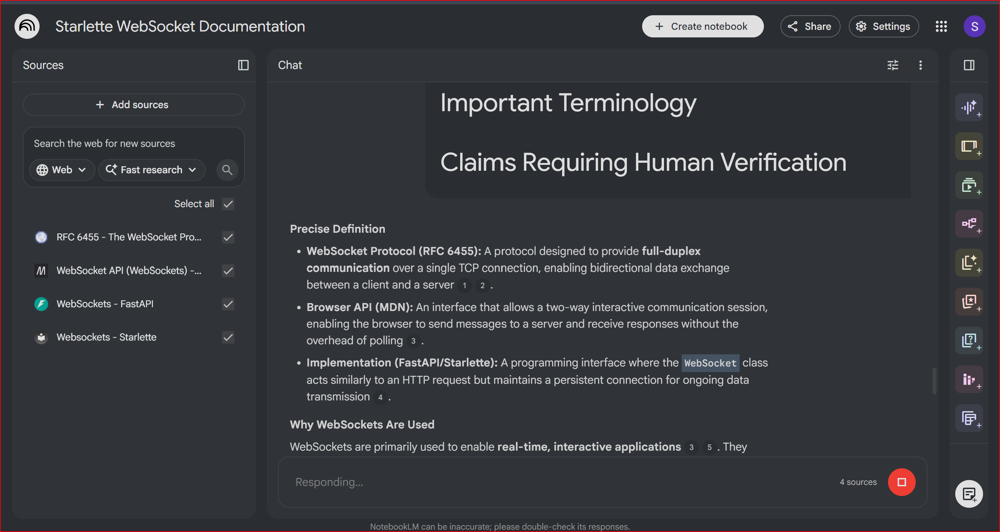
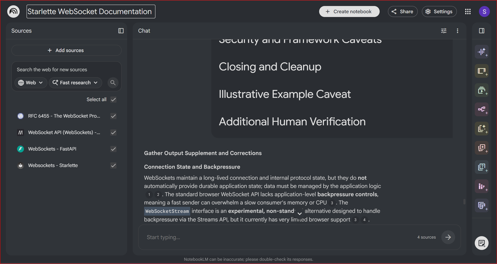
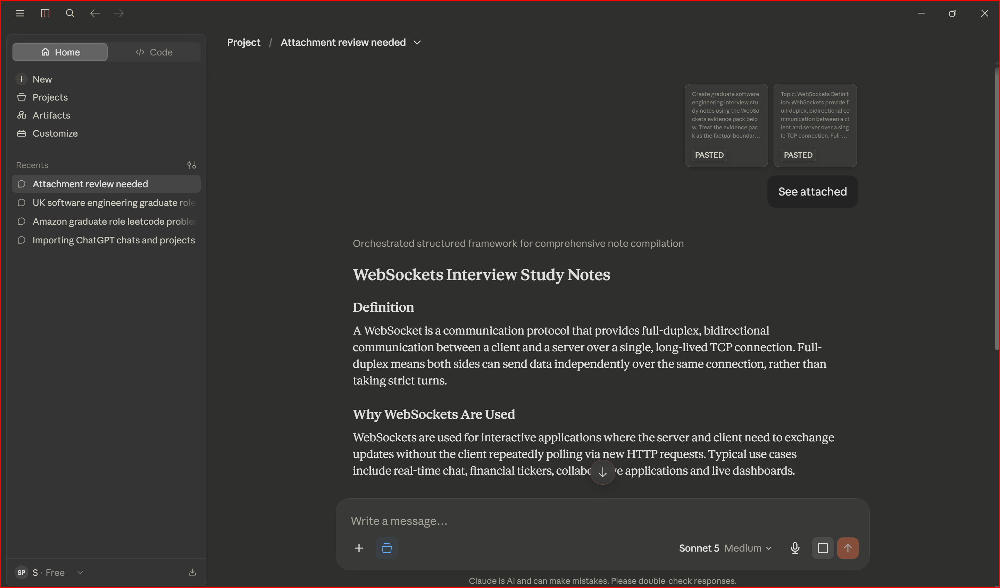
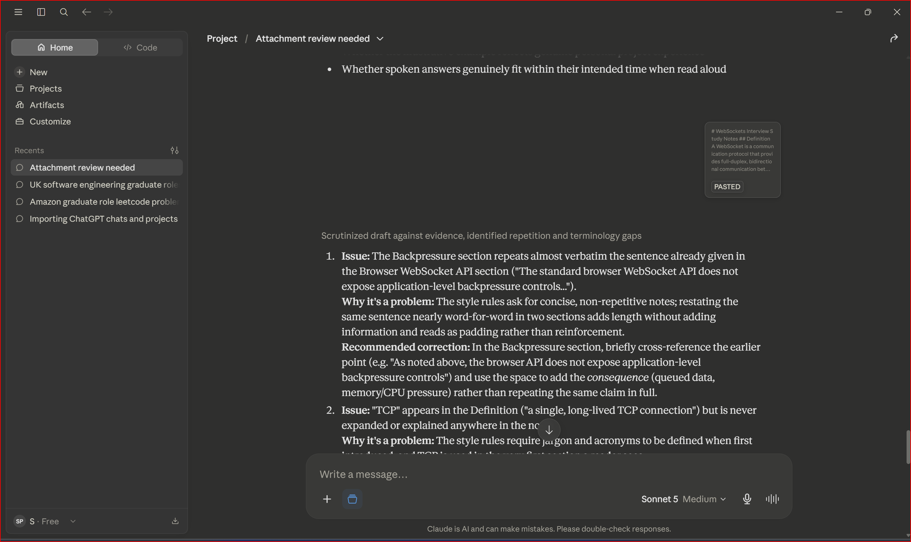
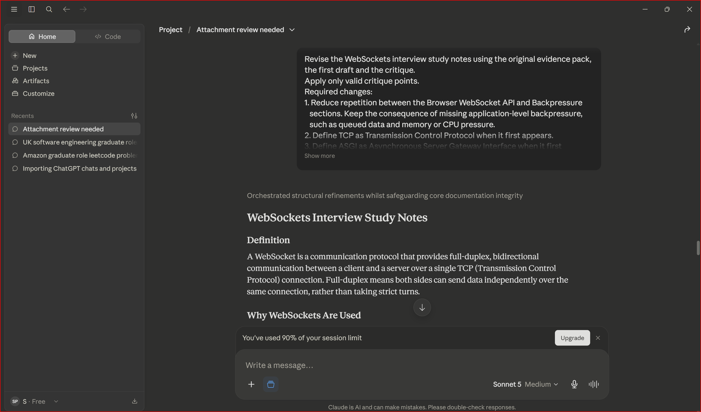

# Run 5: WebSockets

## Input

WebSockets

## Brand-New Input Test

This topic was selected after the reusable workflow and core source-grounding rules had already been established through the first four runs.

The same end-to-end workflow was used:

1. Select authoritative sources
2. Gather evidence in NotebookLM
3. Produce a consolidated evidence pack
4. Generate a first draft in Claude
5. Run a separate Claude critique
6. Produce a final revision
7. Complete human review

The initial NotebookLM prompt had to be shortened because the send button remained disabled. This was recorded as a genuine workflow failure. The shorter prompt preserved the same source boundary, research goals and output structure.

## Sources

- RFC 6455 — The WebSocket Protocol
- MDN — WebSocket API
- FastAPI — WebSockets
- Starlette — WebSockets

## Gather Output

### Precise Definition

A WebSocket is a protocol for full-duplex, bidirectional communication between a client and server over one TCP connection. Full-duplex means both sides can send data independently over the same connection.

The browser WebSocket API provides a two-way interactive session without requiring repeated polling. FastAPI and Starlette expose framework interfaces for accepting, receiving from and sending through WebSocket connections.

### Why WebSockets Are Used

WebSockets are useful for applications that need ongoing, low-latency updates in both directions. Typical examples include chat, financial tickers, collaborative tools and live dashboards.

They reduce the need for repeated HTTP polling, but they are not automatically the best option for every application.

### WebSockets and HTTP

A WebSocket connection begins as an HTTP GET request. The client asks the server to upgrade the connection. If the server accepts, the communication switches from the ordinary HTTP request-response model to the WebSocket protocol.

WebSockets complement HTTP rather than replacing it completely.

The connection is long-lived and maintains protocol connection state. This does not automatically provide durable application state or persistent message storage.

### Opening Handshake

The client request includes:

- `Upgrade: websocket`, requesting a protocol switch
- `Connection: Upgrade`, indicating that the upgrade applies to the current connection
- `Sec-WebSocket-Key`, a client-generated nonce used during the handshake

`Sec-WebSocket-Key` is not an authentication or authorisation mechanism.

If the server accepts, it returns:

- `101 Switching Protocols`
- `Sec-WebSocket-Accept`, derived from the client key and showing that the server understands the WebSocket handshake

### Connection Lifecycle

1. Opening handshake
2. Open connection
3. Data exchange
4. Closing handshake
5. Closed connection

A connection can also end abnormally through network loss, browser closure, server shutdown, infrastructure timeout or unexpected failure.

### Messages and Frames

A frame is a protocol-level unit of WebSocket data. A message is the logical application-level data being communicated.

One message can be carried in one frame or divided across several fragmented frames. Frames and messages are therefore not always identical.

Client-to-server frames are masked as required by the protocol.

### Text, Binary and JSON Data

- Text frames carry UTF-8 encoded text.
- Binary frames carry raw bytes.
- JSON is not a native WebSocket frame type.
- Frameworks serialise JSON over text or binary frames according to their implementation.
- Starlette documents text framing as the default for JSON, with a binary option. This is version-specific and requires human verification.

### Control Frames, Ping and Pong

Control frames manage the connection rather than carrying normal application data.

- Ping checks whether a peer remains responsive.
- Pong responds to Ping.
- Close begins the closing handshake.

### Closing Connections

A clean shutdown normally involves one peer sending a Close frame and the other replying with a Close frame.

Close codes can describe the reason:

- 1000 means normal closure.
- 1001 means going away.

Connections can also terminate abnormally.

### Browser WebSocket API

The standard browser interface is the `WebSocket` object.

Common events include:

- `onopen`
- `onmessage`
- `onerror`
- `onclose`

The standard browser API does not expose application-level backpressure controls. `WebSocketStream` is an experimental, non-standard alternative with limited browser support.

### FastAPI and Starlette WebSockets

FastAPI uses Starlette's WebSocket interface.

Typical operations include:

- `await websocket.accept()`
- `send_text()`
- `send_bytes()`
- `send_json()`
- `receive_text()`
- `receive_bytes()`
- `receive_json()`
- `websocket.close()`

Starlette also provides asynchronous iterators for receiving messages.

`send_denial_response()` can send an HTTP denial response before the WebSocket is accepted, but it depends on support from the underlying ASGI server and extension.

### Multiple Clients and Broadcasting

FastAPI and Starlette do not automatically broadcast messages.

A simple application can keep active WebSocket connections in memory and iterate through them. This works only inside one process. It does not automatically work across multiple workers or server instances.

Cross-worker broadcasting requires shared coordination, but the exact technology is deployment-specific.

### Authentication, Authorisation and Security

Authentication, authorisation, Origin validation and transport encryption are separate concerns.

- Authentication verifies identity.
- Authorisation determines permitted actions.
- Origin validation helps assess whether a browser connection comes from an expected site.
- `wss` uses TLS to protect data in transit.

Using `wss` does not automatically secure the whole application.

### Error Handling and Disconnections

FastAPI and Starlette can raise `WebSocketDisconnect` when a connection closes or is lost.

Applications need cleanup logic to remove dead connections, avoid sending to closed connections and release resources.

### Delivery Guarantees and Reconnection

Calling a send method does not prove that the recipient application received, understood or processed the message.

Acknowledgements, replay, retry, recovery of missed messages and automatic reconnection are application-level responsibilities.

### Backpressure

The standard browser API does not expose application-level backpressure controls. If messages arrive faster than the application can process them, queued data can increase memory or CPU use.

Low-level transport flow control should not be confused with application-level backpressure exposed to browser code.

### Scaling and Deployment

Production review should include:

- Proxy and load-balancer timeouts
- Connection limits
- Message-size limits
- Cleanup behaviour
- Cross-worker broadcasting
- Cross-instance coordination
- Authentication persistence
- Reconnection policy
- Acknowledgement and replay requirements

The actual resource impact depends on workload, connection count, message frequency and deployment architecture.

### Common Use Cases

- Real-time chat
- Financial and stock tickers
- Collaborative editing
- Live dashboards
- Interactive browser applications
- Low-latency bidirectional updates

### Advantages

- Full-duplex communication
- Independent sending by client and server
- Reduced need for repeated HTTP polling
- Server-pushed updates
- Reuse of one long-lived connection

### Limitations and Trade-offs

- More lifecycle management than ordinary stateless request-response endpoints
- Not automatically faster for every workload
- Unnecessary for occasional request-response communication
- Authentication and security require separate design
- Reconnection, acknowledgements, retry and replay are not automatic
- The standard browser API lacks exposed application-level backpressure controls
- In-memory broadcasting does not scale across processes
- Infrastructure must support long-lived connections

### Illustrative Example

A basic FastAPI `ConnectionManager` can:

1. Store active connections in memory.
2. Accept a WebSocket.
3. Receive text in a loop.
4. Send a message to each active connection.
5. Catch `WebSocketDisconnect` and remove the disconnected client.

This example is illustrative, single-process and not automatically production-ready. It is not presented as personal implementation experience.

### Common Mistakes and Misconceptions

- WebSockets replace HTTP.
  - They use HTTP for the opening handshake and complement HTTP APIs.

- Frames and messages are identical.
  - One message can span several frames.

- JSON is a native frame type.
  - JSON is serialised over text or binary frames.

- Ping and Pong are ordinary application messages.
  - They are control frames.

- Sending proves processing.
  - Application-level confirmation requires acknowledgements.

- FastAPI automatically broadcasts.
  - The application must implement broadcasting.

- An in-memory manager works across workers.
  - It is local to one process.

- Reconnection and replay are automatic.
  - They are application responsibilities.

- `wss` secures the whole application.
  - It protects data in transit only.

### Important Terminology

- Full-duplex: Both peers can send independently.
- TCP: Transmission Control Protocol.
- Opening handshake: The initial HTTP exchange requesting and confirming the upgrade.
- 101 Switching Protocols: The HTTP status confirming the switch.
- Frame: A protocol-level unit.
- Message: Logical application data carried by one or more frames.
- Fragmentation: Splitting one message across several frames.
- Control frame: A frame used to manage the connection.
- Masking: A protocol requirement for client-to-server frames.
- Backpressure: A mechanism allowing a slower consumer to limit incoming supply.
- WebSocketDisconnect: A framework exception indicating that a connection ended.
- ASGI: Asynchronous Server Gateway Interface.

### Claims Requiring Human Verification

- Current browser support for WebSocketStream
- Installed FastAPI and Starlette versions
- Starlette JSON framing behaviour
- ASGI server support for denial responses
- Proxy and load-balancer timeout settings
- Authentication and Origin validation
- Connection and message-size limits
- Reconnection and retry policy
- Acknowledgement and replay requirements
- Cross-worker coordination
- Whether the example matches genuine personal experience

### Gather Output Supplement and Corrections

The initial gather output was supplemented to correct or qualify several points:

- A long-lived WebSocket maintains protocol state but does not automatically provide durable application state.
- The browser API limitation concerns exposed application-level backpressure controls rather than all lower-level flow control.
- Sending a message does not prove application processing.
- Acknowledgements, replay and reconnection are application responsibilities.
- An in-memory connection list is limited to one process.
- Cross-process broadcasting requires shared coordination, but no single technology is mandatory.
- `wss` protects data in transit but does not replace authentication, authorisation or Origin checks.
- `send_denial_response()` depends on ASGI server extension support.
- JSON text-versus-binary behaviour is version-specific.
- The basic ConnectionManager example is illustrative and not production-ready.

## Synthesised Evidence Pack

Topic: WebSockets

Definition:

WebSockets provide full-duplex, bidirectional communication between a client and server over a single TCP connection. Both sides can send data independently.

Purpose:

They support interactive applications that need ongoing two-way updates without repeated HTTP polling.

WebSockets and HTTP:

- The connection starts as an HTTP GET request.
- The client requests an upgrade.
- The server can respond with 101 Switching Protocols.
- Communication then continues through the WebSocket protocol.
- WebSockets complement HTTP rather than replacing it.
- Long-lived protocol state does not equal durable application state.

Opening handshake:

- `Upgrade: websocket` requests the protocol switch.
- `Connection: Upgrade` applies the upgrade to the connection.
- `Sec-WebSocket-Key` carries a client nonce and is not authentication.
- `Sec-WebSocket-Accept` is derived from the client key.
- `101 Switching Protocols` confirms the accepted switch.

Connection lifecycle:

Opening handshake, open connection, data exchange, closing handshake and closed connection. Unexpected termination is also possible.

Messages and frames:

Frames are protocol units. Messages are logical application data and can use one or several fragmented frames. Client-to-server frames are masked.

Text, binary and JSON:

Text frames carry UTF-8 data. Binary frames carry bytes. JSON is serialised over text or binary frames according to framework behaviour. Starlette behaviour is version-specific.

Control frames:

Ping, Pong and Close manage the connection and are not ordinary application messages.

Closing:

A normal closure exchanges Close frames. Code 1000 means normal closure and 1001 means going away. Abnormal termination can also occur.

Browser API:

The `WebSocket` object provides events such as `onopen`, `onmessage`, `onerror` and `onclose`. The standard browser API lacks exposed application-level backpressure controls. WebSocketStream is experimental and limited in support.

FastAPI and Starlette:

Typical methods include accept, send and receive operations for text, bytes and JSON, plus close. Denial responses depend on ASGI server extension support.

Multiple clients and broadcasting:

Broadcasting is not automatic. In-memory tracking works only within one process. Cross-process broadcasting requires shared coordination.

Authentication, authorisation and security:

Authentication, authorisation, Origin validation and `wss` transport encryption are distinct. `wss` protects data in transit but does not secure the entire application.

Errors and cleanup:

Applications must catch disconnections, remove dead connections and release resources.

Delivery guarantees and reconnection:

Sending does not prove processing. Acknowledgements, replay, retry and reconnection are application-level responsibilities.

Backpressure:

The standard browser API does not expose application-level backpressure controls. Queued data can create memory or CPU pressure.

Scaling and deployment:

Multi-process and multi-instance deployments need shared coordination. Infrastructure settings, limits and resource impact depend on deployment.

Common use cases:

Chat, tickers, collaborative editing, dashboards and other low-latency bidirectional applications.

Advantages:

Full-duplex communication, server-pushed updates and reduced repeated polling.

Limitations:

Lifecycle complexity, deployment configuration, no automatic replay or reconnection, browser backpressure limitations and single-process limits of in-memory broadcasting.

Illustrative example:

A basic FastAPI ConnectionManager tracks active sockets, accepts connections, receives data, broadcasts by iteration and removes disconnected clients. It is illustrative, single-process and not automatically production-ready.

Human review:

Browser support, framework versions, ASGI extensions, security, infrastructure, limits, reconnection policy, acknowledgement requirements and cross-worker coordination require verification.

Source references:

- RFC 6455 — The WebSocket Protocol
- MDN — WebSocket API
- FastAPI — WebSockets
- Starlette — WebSockets

## Claude First Draft

# WebSockets Interview Study Notes

## Definition

A WebSocket is a communication protocol that provides full-duplex, bidirectional communication between a client and a server over a single, long-lived TCP connection. Full-duplex means both sides can send data independently over the same connection.

## Why WebSockets Are Used

WebSockets are used for interactive applications where the server and client need to exchange updates without repeated HTTP polling. Typical examples include chat, financial tickers, collaborative applications and live dashboards.

## WebSockets and HTTP

A WebSocket begins as an HTTP request. After a successful upgrade, communication switches to the WebSocket protocol. WebSockets complement HTTP rather than replacing it. The connection is long-lived and maintains protocol state, but durable application state must be designed separately.

## Opening Handshake

The client sends an HTTP GET request containing `Upgrade: websocket`, `Connection: Upgrade` and `Sec-WebSocket-Key`. If accepted, the server returns `101 Switching Protocols` and `Sec-WebSocket-Accept`.

`Sec-WebSocket-Key` is not an authentication or authorisation mechanism.

## Connection Lifecycle

The lifecycle is opening handshake, open connection, data exchange, closing handshake and closed connection. Network loss, browser closure, server shutdown or infrastructure failure can also end the connection.

## Messages and Frames

A frame is a protocol-level unit, while a message is logical application data. One message can be sent in one frame or divided across several fragmented frames.

## Text, Binary and JSON Data

Text frames carry UTF-8 data and binary frames carry bytes. JSON is not a native frame type; frameworks serialise it over text or binary frames. Starlette's exact behaviour is version-specific.

## Control Frames

Ping, Pong and Close are control frames used to manage the connection rather than carry ordinary application data.

## Closing Connections

A normal closure exchanges Close frames. Code 1000 means normal closure and 1001 means going away. Connections can also end abnormally.

## Browser WebSocket API

The browser `WebSocket` object exposes events including `onopen`, `onmessage`, `onerror` and `onclose`. The standard API does not expose application-level backpressure controls. WebSocketStream is experimental and limited in support.

## FastAPI and Starlette WebSockets

FastAPI uses Starlette's WebSocket interface. Common operations include accepting, sending and receiving text, bytes and JSON, and closing the connection. `send_denial_response()` depends on ASGI server extension support and requires human verification.

FastAPI and Starlette do not automatically provide broadcasting, reconnection, replay or delivery acknowledgements.

## Multiple Clients and Broadcasting

A basic application can track active WebSockets in memory and iterate through them. This works only within one process. Multiple workers or instances require shared coordination.

## Authentication, Authorisation and Security

Authentication, authorisation, Origin validation and `wss` encryption are separate concerns. `wss` protects data in transit but does not secure the entire application.

## Errors, Disconnections and Cleanup

Applications should catch `WebSocketDisconnect`, remove dead connections and release resources. Both clean and abnormal disconnections need handling.

## Delivery Guarantees and Reconnection

Calling send does not prove the recipient processed a message. Acknowledgements, replay, retry and automatic reconnection must be designed at application level.

## Backpressure

The standard browser API does not expose application-level backpressure controls. If data arrives too quickly, queued messages can increase memory or CPU use.

## Scaling and Deployment

Long-lived connections require infrastructure and lifecycle management. In-memory tracking is single-process, so multi-process and multi-instance systems need shared coordination.

## Practical Example

A generic FastAPI ConnectionManager can store active sockets, accept connections, receive messages, send to each connection and remove disconnected clients. The example is illustrative, single-process and not automatically production-ready.

## Common Use Cases

- Real-time chat
- Financial tickers
- Collaborative editing
- Live dashboards
- Low-latency bidirectional interfaces

## Advantages

- Full-duplex communication
- Independent client and server sending
- Reduced repeated polling
- Server-pushed updates

## Limitations and Trade-offs

- More lifecycle management than stateless endpoints
- Not automatically faster for every workload
- No automatic acknowledgements, replay or reconnection
- Browser API backpressure limitations
- In-memory broadcasting does not scale across processes
- Infrastructure requires configuration for long-lived connections

## Important Terminology

- Full-duplex means both peers can send independently.
- Opening handshake is the initial HTTP exchange requesting the upgrade.
- Frame is a protocol-level unit.
- Message is logical application data.
- Fragmentation splits one message across several frames.
- Backpressure lets a slower consumer limit incoming supply.
- ASGI is the server interface used by FastAPI and Starlette.

## Common Mistakes and Misconceptions

- WebSockets replace HTTP. They use HTTP for the handshake and complement HTTP APIs.
- JSON is a native frame type. It is serialised over text or binary frames.
- Sending proves processing. Application acknowledgements are needed for confirmation.
- FastAPI broadcasts automatically. The application must implement broadcasting.
- In-memory tracking works across workers. It is local to one process.
- `wss` secures everything. It protects transport data only.

## 30-to-60-Second Interview Answer

A WebSocket is a long-lived, full-duplex connection that starts as an HTTP request and upgrades to the WebSocket protocol after the server returns 101 Switching Protocols. Once open, both the client and server can send messages independently, which suits chat or live dashboards better than repeated polling. WebSockets do not replace HTTP, and features such as reconnection, replay and application security still have to be designed separately.

## Likely Interview Questions

### How does a WebSocket connection get established?

It starts as an HTTP GET request with upgrade headers. If the server accepts, it responds with 101 Switching Protocols and Sec-WebSocket-Accept. Communication then continues through the WebSocket protocol.

### What is the difference between a message and a frame?

A frame is a protocol-level unit, while a message is logical application data. One message can use one frame or several fragmented frames.

### Does WebSocket support JSON directly?

No. WebSocket data frames are text or binary. Frameworks serialise JSON over one of those frame types.

### Does calling send prove that a message was processed?

No. Sending does not confirm that the recipient application processed the message. Application acknowledgements are required when that guarantee matters.

### Does an in-memory connection list work across workers?

No. It is local to one process. Multi-worker broadcasting requires shared coordination.

## Human Review Checklist

AI-assisted review does not guarantee correctness.

Verify browser support, framework versions, ASGI extension support, authentication, Origin validation, TLS configuration, infrastructure timeouts, resource limits, reconnection policy, acknowledgement requirements, cross-worker coordination and spoken-answer timing.

## Claude Critique

1. Issue: The Backpressure section repeated the browser API limitation almost word for word.

   Why it was a problem: Repetition added length without adding meaning.

   Recommended correction: Cross-reference the earlier point and focus on queued data and memory or CPU pressure.

2. Issue: TCP appeared in the definition without being expanded.

   Why it was a problem: Technical acronyms should be defined when first introduced.

   Recommended correction: Expand TCP as Transmission Control Protocol at first use.

3. Issue: ASGI was used before being defined.

   Why it was a problem: A reader unfamiliar with the term would encounter it without explanation.

   Recommended correction: Define ASGI as Asynchronous Server Gateway Interface at first use.

4. Issue: The definition could be more concise by separating the core protocol definition from the later explanation of long-lived protocol state.

   Why it was a problem: The opening definition was slightly overloaded.

   Recommended correction: Keep the definition focused on full-duplex communication over one TCP connection.

5. Issue: The critique claimed that `send_denial_response()` lacked a human-review warning.

   Why it was a problem: Manual inspection showed that the warning was already present.

   Recommended correction: Reject this critique point rather than duplicate the warning.

6. Issue: The spoken answer had not been verified by timing it aloud.

   Why it was a problem: Sentence count alone does not guarantee the intended duration.

   Recommended correction: Shorten the answer slightly and retain an explicit human timing check.

7. Issue: Masking appeared only in terminology rather than in the main explanation.

   Why it was a problem: The concept lacked context.

   Recommended correction: Add a concise statement that client-to-server frames are masked.

### Strengths That Should Be Preserved

- Clear distinction between HTTP and WebSocket communication
- Correct distinction between messages and frames
- Correct treatment of JSON
- Strong caveats around delivery, reconnection and replay
- Correct separation of security concerns
- Clear single-process limitation for in-memory broadcasting
- Clear warning that the illustrative example is not production-ready
- Useful human-review checklist

## Final Revised Output

# WebSockets Interview Study Notes

## Definition

A WebSocket is a communication protocol that provides full-duplex, bidirectional communication between a client and a server over a single TCP, meaning Transmission Control Protocol, connection. Full-duplex means both sides can send data independently over the same connection.

## Why WebSockets Are Used

WebSockets are used for interactive applications where the server and client need to exchange updates without repeated HTTP polling. Typical examples include chat, financial tickers, collaborative applications and live dashboards.

## WebSockets and HTTP

A WebSocket begins as an HTTP request. After a successful upgrade, communication switches to the WebSocket protocol. WebSockets complement HTTP rather than replacing it. The connection is long-lived and maintains protocol connection state, but durable application state and message storage must be designed separately.

## Opening Handshake

The client sends an HTTP GET request containing:

- `Upgrade: websocket`
- `Connection: Upgrade`
- `Sec-WebSocket-Key`

If the server accepts, it returns:

- `101 Switching Protocols`
- `Sec-WebSocket-Accept`

`Sec-WebSocket-Key` helps identify a WebSocket-aware handshake but is not an authentication or authorisation mechanism.

## Connection Lifecycle

The lifecycle is opening handshake, open connection, data exchange, closing handshake and closed connection. Network loss, browser closure, server shutdown or infrastructure failure can also end the connection.

## Messages and Frames

A frame is a protocol-level unit, while a message is logical application data. One message can be carried in one frame or divided across several fragmented frames. Client-to-server frames are masked as required by the protocol.

## Text, Binary and JSON Data

Text frames carry UTF-8 data and binary frames carry bytes. JSON is not a native frame type; frameworks serialise it over text or binary frames. Starlette's exact behaviour is version-specific and requires human verification.

## Control Frames

Ping, Pong and Close are control frames used to manage the connection rather than carry ordinary application data.

## Closing Connections

A normal closure exchanges Close frames. Code 1000 means normal closure and 1001 means going away. Connections can also end abnormally.

## Browser WebSocket API

The browser `WebSocket` object exposes events such as `onopen`, `onmessage`, `onerror` and `onclose`. The standard API does not expose application-level backpressure controls. WebSocketStream is experimental, non-standard and limited in support.

## FastAPI and Starlette WebSockets

FastAPI uses Starlette's WebSocket interface, built on ASGI, meaning Asynchronous Server Gateway Interface. Typical operations include accepting a connection, sending and receiving text, bytes or JSON, and closing the connection.

`send_denial_response()` depends on ASGI server extension support and requires human verification.

FastAPI and Starlette do not automatically provide broadcasting, reconnection, replay or delivery acknowledgements.

## Multiple Clients and Broadcasting

An application can track active WebSocket connections in memory and iterate through them. This works only within one process. Multiple workers or instances require shared coordination, with the technology selected according to the deployment.

## Authentication, Authorisation and Security

Authentication, authorisation, Origin validation and `wss` encryption are separate concerns. `wss` uses TLS to protect data in transit but does not secure the entire application.

## Errors, Disconnections and Cleanup

Applications should catch `WebSocketDisconnect`, remove dead connections and release resources. Clean and abnormal disconnections both require handling.

## Delivery Guarantees and Reconnection

Calling send does not prove that the recipient application processed a message. Acknowledgements, replay, retry and automatic reconnection must be designed at application level.

## Backpressure

As noted in the browser API section, application-level backpressure controls are not exposed. If messages arrive faster than they can be processed, queued data can increase memory or CPU use.

WebSocketStream attempts stream-based backpressure but remains experimental and limited in support.

## Scaling and Deployment

Long-lived connections require lifecycle and infrastructure management. In-memory tracking is limited to one process, so multi-process and multi-instance deployments need shared coordination. Proxy timeouts, message limits, connection limits and recovery requirements need human review.

## Practical Example

A generic FastAPI ConnectionManager can store active connections, accept clients, receive messages, send to each connection and remove disconnected clients. This is an illustrative, single-process example and is not automatically production-ready or evidence of personal implementation experience.

## Common Use Cases

- Real-time chat
- Financial tickers
- Collaborative editing
- Live dashboards
- Low-latency bidirectional interfaces

## Advantages

- Full-duplex communication
- Independent client and server sending
- Reduced repeated polling
- Server-pushed updates

## Limitations and Trade-offs

- More lifecycle management than stateless endpoints
- Not automatically faster for every workload
- No automatic acknowledgements, replay or reconnection
- Browser API backpressure limitations
- In-memory broadcasting does not scale across processes
- Infrastructure needs configuration for long-lived connections

## Important Terminology

- Full-duplex: Both peers can send independently.
- TCP: Transmission Control Protocol.
- Opening handshake: The initial HTTP exchange requesting the upgrade.
- 101 Switching Protocols: The status confirming the switch.
- Frame: A protocol-level unit.
- Message: Logical application data.
- Fragmentation: Splitting one message across several frames.
- Control frame: A frame used for connection management.
- Masking: A protocol requirement for client-to-server frames.
- Backpressure: A mechanism allowing a slower consumer to limit incoming supply.
- WebSocketDisconnect: A framework exception indicating that a connection ended.
- ASGI: Asynchronous Server Gateway Interface.

## Common Mistakes and Misconceptions

- WebSockets replace HTTP. They use HTTP for the handshake and complement HTTP APIs.
- Frames and messages are identical. One message can span several frames.
- JSON is a native frame type. It is serialised over text or binary frames.
- Sending proves processing. Application acknowledgement is required for confirmation.
- FastAPI broadcasts automatically. The application must implement broadcasting.
- In-memory tracking works across workers. It is local to one process.
- `wss` secures the whole application. It protects transport data only.

## 30-to-60-Second Interview Answer

A WebSocket is a long-lived, full-duplex connection that starts as an HTTP request and upgrades to the WebSocket protocol after the server returns 101 Switching Protocols. Once open, both sides can send messages independently, which suits chat or live dashboards better than repeated polling. WebSockets do not replace HTTP, and reconnection, replay and application security still have to be designed separately.

## Likely Interview Questions

### How does a WebSocket connection get established?

It starts as an HTTP GET request with upgrade headers. If the server accepts, it responds with 101 Switching Protocols and Sec-WebSocket-Accept. Communication then continues through WebSocket.

### What is the difference between a message and a frame?

A frame is a protocol-level unit, while a message is logical application data. One message can use one frame or several fragmented frames.

### Does WebSocket support JSON directly?

No. WebSocket frames are text or binary. Frameworks serialise JSON over one of those types.

### Does calling send prove that a message was processed?

No. Sending does not confirm processing. Application acknowledgements are needed when that guarantee matters.

### Does an in-memory connection list work across multiple workers?

No. It is local to one process. Multi-worker and multi-instance broadcasting require shared coordination.

## Human Review Checklist

AI-assisted review does not guarantee correctness.

Verify:

- WebSocketStream browser support
- FastAPI, Starlette and ASGI server versions
- Starlette JSON framing behaviour
- ASGI denial-response extension support
- Authentication and Origin validation
- TLS deployment configuration
- Proxy and load-balancer timeouts
- Connection and message-size limits
- Cleanup and resource management
- Reconnection and retry policies
- Acknowledgement and replay requirements
- Cross-worker coordination
- Real-world performance and resource use
- Whether the example reflects genuine experience
- Whether the spoken answer fits the intended time when read aloud

## Human Review

### Checks Completed

The final revision was manually reviewed against the source-grounded evidence pack.

The review confirmed that:

- The HTTP opening handshake and subsequent WebSocket protocol communication were clearly distinguished.
- WebSockets were not presented as a complete replacement for HTTP.
- Frames and application messages were distinguished.
- JSON was not described as a native frame type.
- Ping, Pong and Close were treated as control frames.
- Authentication, authorisation, Origin validation and `wss` encryption were kept separate.
- Sending was not treated as proof of application processing.
- Acknowledgements, replay, retry and reconnection were presented as application responsibilities.
- In-memory broadcasting was limited to one process.
- The practical example was labelled illustrative, single-process and not automatically production-ready.
- TCP and ASGI were defined when first introduced.
- Masking was included in the main explanation.
- The five interview answers were concise and consistent with the evidence pack.
- The spoken answer was shortened and still requires a final read-aloud timing check by the user.

AI-assisted review does not guarantee technical correctness.

### Manual Corrections Required

- Shortened the first NotebookLM prompt after the send button remained disabled.
- Added a gather supplement to qualify broad claims about backpressure, delivery, reconnection and scaling.
- Corrected the synthesis so Sec-WebSocket-Key was not presented as authentication.
- Removed malformed source references and Conversation History markers.
- Replaced absolute pub/sub claims with deployment-specific shared coordination.
- Kept Starlette JSON behaviour and denial responses marked as version-specific or server-dependent.
- Rejected a false-positive critique about a missing denial-response warning.
- Defined TCP and ASGI at first use.
- Added masking to the main explanation.
- Reduced repetition in the Backpressure section.
- Shortened the spoken answer.

### Brand-New Input Test Result

Passed with documented human intervention.

The WebSockets topic completed the full workflow from source selection through human review. The overall workflow remained unchanged. The shortened gather prompt was a recorded response to an interface failure, and later repair prompts were recorded responses to specific output-quality failures.

The run produced:

- A source-grounded gather output
- A gather correction supplement
- A consolidated evidence pack
- A Claude first draft
- A separate Claude critique
- A final Claude revision
- A human-review record
- A documented failure log

## Workflow Failures and Human Intervention

### Failure 1: Initial NotebookLM Prompt Could Not Be Submitted

The first gather prompt was too long for the NotebookLM interface, and the send button remained disabled.

Human intervention preserved the source boundary and research requirements while shortening the wording.

### Failure 2: Gather Output Used Overly Broad Claims

The first gather output described browser backpressure and cross-process broadcasting too broadly.

A focused supplement clarified application-level backpressure, durable state, delivery confirmation, reconnection and shared coordination.

### Failure 3: Synthesis Contained Imprecise Wording

The first synthesis described Sec-WebSocket-Key too strongly, included malformed source references and used Conversation History markers.

A repair pass removed unsupported implications, restored the four source references and qualified framework-specific claims.

### Failure 4: Claude Critique Produced a False Positive

Claude claimed that the denial-response caveat was missing. Manual inspection showed that it was already present.

The recommendation was rejected rather than applied.

### Overall Human Intervention

Human review was needed to:

- Shorten an unsubmitable prompt
- Identify overly absolute claims
- Request targeted repairs
- Reject an incorrect critique point
- Check terminology and internal consistency
- Confirm that the example was not presented as personal experience
- Preserve human-verification caveats

## Timing

| Activity | Time |
|---|---:|
| Finding and importing sources | Not separately recorded |
| NotebookLM gather stage | Not separately recorded |
| NotebookLM synthesis stage | Not separately recorded |
| Claude first draft | Not separately recorded |
| Claude critique and revision | Not separately recorded |
| Human review and documentation | Not separately recorded |
| Total Run 5 time | Not calculable from the available records |

The timing record is intentionally honest. Exact stage timings were not captured, so no figures were invented retrospectively.

## Evidence

HTML image references are used so that no square-bracket placeholders remain in this file.

