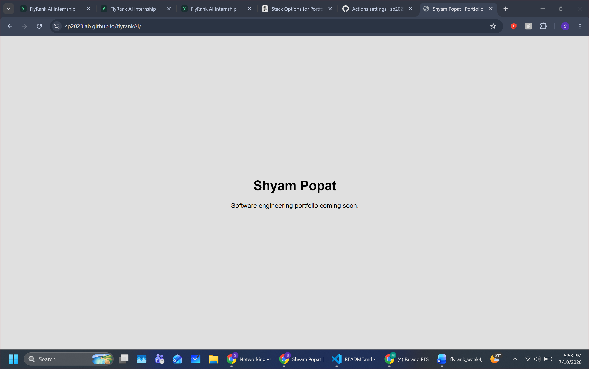

## Empty but Live: Portfolio Deployment

Live URL:
https://sp2023lab.github.io/flyrankAI/

Stack:
Astro with TypeScript, hosted through GitHub Pages and deployed using GitHub Actions.

My near-blank portfolio is now publicly live and displays my name and a
coming-soon message. I opened the website on my phone to confirm that it is
reachable from a second device.

I have also loaded my identity kit, content map, sitemap and project case
studies into my Claude Project in preparation for the main portfolio build.

The second-device screenshot is attached.

